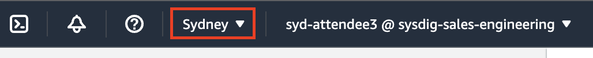
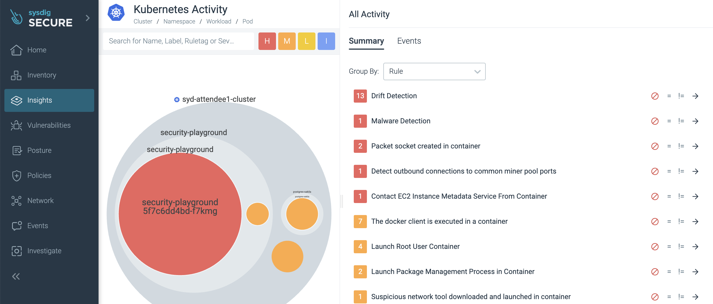
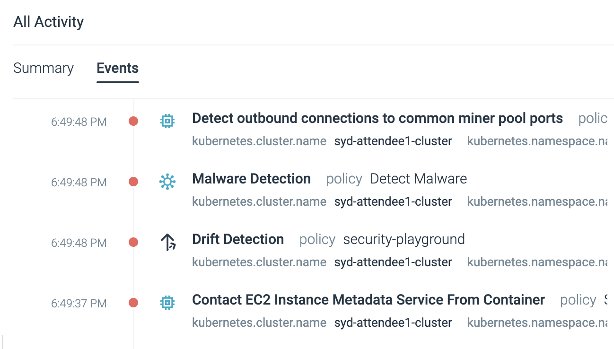
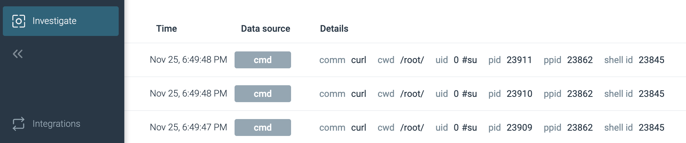

# Sysdig Hands-on EKS Security Workshop

Welcome to Sysdig's hands-on workshop. In this workshop, you'll experience some of the security challenges of Kubernetes/EKS first-hand - and how Sysdig can help.

We have provisioned a separate EKS cluster and EC2 instance (to serve as a jumpbox/bastion) for each of you. You'll connect to that jumpbox via AWS SSM Session Manager in your browser - and it is preloaded with all the tools that you'll need to interact with your EKS cluster and work through today's labs.

We have also provisioned a user for you within Sysdig Secure. While this Sysdig SaaS tenancy is shared between everyone in the workshop today, your login is tied to a team within it which, in turn, is filtered to only show you information about your EKS cluster/environment.

## Logging into your environment

### AWS Environment

You'll have received your IAM username and password from the facilitator. To sign into your environment:

1. Open a web browser and go to https://aws.amazon.com/console/
1. If prompted, choose to sign in with an IAM user (as opposed to the Root user) and enter the AWS Account ID of **sysdig-sales-engineering** 
1. Enter the IAM username and password you were provided and click the **Sign in** button
1. Pick the **Sydney** or **Singapore** region in the drop-down in the upper right of the console (you'll have been told which of the two with your login details)
    1. 
1. Go to the EC2 service's console (you can type EC2 in the Search box on top and then click on the EC2 service in the results)
1. Click on the **Instances (running)** link under **Resources** to be taken to a list of running EC2 Instances 
    1. 
1. In the **Find instance by attribute or tag** search box type **AttendeeXX** (where XX is your attendee number at the end of your username) and press enter/return 
1. Tick the box next to the jumpbox and then click the **Connect** button on top 
    1. 
1. Choose the **Session Manager** tab and then click the **Connect** button 
    1. 
1. Once your terminal window opens type **sudo bash** then **cd ~** (as all of our workshop content is pre-installed in the root user's home directory) 
    1. **NOTE:** if you close and re-open the Session Manager Session/Terminal window then you'll need to rerun those two commands to return to the root user and its home directory.
1. Type **kubectl get pods -A** and you'll see a list of all the running Pods in your EKS cluster.

> **NOTE**: Even though we will refer you to a few example files on GitHub throughout the workshop, everything you need to run has already been pre-installed onto the jumpbox in /root. You don't need to copy/paste or **git clone** anything from GitHub today.

### Sysdig environment

You'll have received a login and password for Sysdig from the facilitator. To sign into your environment:

1. Open a web browser and go to https://sysdig.com
1. Under the Log In dropdown on the top right of the page choose **AWS-AP-Sydney** under **Sysdig Secure** (NOTE: not Sysdig Monitor which we won't be looking at today)
    1. 
1. Enter the email address and password you were provided for Sysdig and click the **Log in** button
1. If you see the Customize your Sysdig experience screen, then click the **Get into Sysdig** button in the lower right hand corner to take you through to the **Home** screen

## Module 1 - Runtime Threat Detection and Prevention

In our first module, we'll be exploring Sysdig's capabilities around detecting - and even preventing - runtime threats.

Regardless of how an attacker gets in, they will do many of the same things - a predictable sequence of things best explained by the [MITRE ATT&CK Framework](https://attack.mitre.org/). Sysdig's threat research team runs a large fleet of honeypots around the world to learn first-hand all the things people do once they get in - and then continually updates our library of [Rules](https://docs.sysdig.com/en/docs/sysdig-secure/policies/threat-detect-policies/manage-rules/) (what to look for) and [Managed Policies](https://docs.sysdig.com/en/docs/sysdig-secure/policies/threat-detect-policies/manage-policies/) (what to do when we find it) on behalf of all of our customers. You can also make your own custom (Falco) Rules and/or Policies beyond what we offer if you'd like - this is fully transparent and based on opensource tooling/standards rather than a magic black box!

Our agent(s) continually watch for the **Rules** against various streams of activity (defined in your **Policies**) and then fire **Events** when it sees them, with all the relevant context, in real-time. It can do so against these sources - with more coming soon such as from other popular cloud/SaaS services (such as GitHub, Okta, etc.):
* Linux kernel System Calls of your Nodes/Containers
* The Kubernetes Audit Trail
* The audit trails of AWS, Azure and GCP

In addition to our 'traditional' Rules/Policies-based approach, there are two more features that round out our Threat Detection/Prevention capabilities:
* [Container Drift](https://docs.sysdig.com/en/docs/sysdig-secure/policies/threat-detect-policies/manage-policies/drift-control/) - we can look for any executables that are introduced at runtime that were not in the container image as it was pulled - as well as optionally block them from running
* [Crypto Mining ML Detection](https://docs.sysdig.com/en/docs/sysdig-secure/policies/threat-detect-policies/manage-policies/machine-learning/) - we have introduced our first Machine Learning enabled detection with a model specifically focused on detecting crypto-mining.

### Simulating an attack to generate Events within Sysdig

1. In the Sysdig UI click on **Insights** on the left-hand side
    1. This will likely be empty (we've never seen any suspicious activity for your new environment) and therefore show a **Welcome to Insights** placeholder screen
1. So lets's generate some Events!
    1. Click this link to open the (simple yet insecure) code for the security-playground service on your cluster in a new tab - https://github.com/jasonumiker-sysdig/example-scenarios/blob/main/docker-build-security-playground/app.py
        1. This Python app serves a **very** insecure REST API that will return the contents of any file on the filesystem, write any file to the filesystem and/or execute any file on the filesystem in response to simple **curl** commands
            1. And you can combine them to download/write a file then execute it for example
        1. This is simulating a very bad remote code execution (RCE) vulnerability - which could be either with your own code or in a package it uses (e.g. Log4J, Struts, etc.)
            1. As it is detecting what happens when the vulnerability is being exploited that we're interested in here
    1. Go back to the the Session Manager terminal browser tab for your jumpbox
    1. Type **cat ./example-curls.sh** to have a look at a script with some example **curl** commands we are going to run against the security-playground service:
        1. Reading the sensitive path **/etc/shadow**
        1. Writing a file to **/bin** then **chmod +x**'ing it and running it
        1. Installing **nmap** from **apt** and then running a network scan
        1. Running the **nsenter** command to 'break out' of our container Linux namespace to the host
        1. Running the **crictl** command against the container runtime for the Node (bypassing Kubernetes and the Kubelet to manage it directly)
        1. Using the **crictl** command to grab a Kubernetes secret from another Pod on the same Node (that was decrypted to an environment variable there at runtime)
        1. Using the **crictl** command to run the Postgres CLI **psql** within another Pod on the same Node to exfiltrate some sensitive data
        1. Using the Kubernetes CLI **kubectl** to launch another nefarious workload (leveraging our over-provisioned Kubernetes ServiceAccount that for security-playground)
        1. Running a **curl** command against the AWS EC2 Instance Metadata endpoint for the Node from the security-playground Pod
        1. Finally run the xmrig crypto miner
    1. Go ahead and run that script by typing **./example-curls.sh** and watch all the output that is returned from the attacker's perspective.
    1. Note that the Pod is actually killed a little while into the mining triggered by the last curl because the crypto miner (xmrig) tries to use more memory than the limit set for this container (showing another reason it is a good idea to place such limits in your PodSpecs!)
    1. Then go back to the Sysdig UI tab and refresh that tab in your browser
        1. You'll see a circular visualisation/heatmap of which clusters, namespaces and Pods the runtime events we've seen are coming from on the left
        1. And it also gives you either a summary of those events in the **Summary** tab or a full timeline of them in the **Events** tab on the right
        1. 
    1. Choose the Events tab on the right
    1. As you can see there are a number of events that Sysdig picked up here - in real-time!
        1. 
    1. If you click into the the top **Detect outbound connections to common miner pools** and then scroll through it you'll see all the context of that event including details of the process, the network, the AWS account, the Kubernetes cluster/namespace/deployment, the host as well as the container
       1. In particular the process tree view shows us that our Python app (gunicorn) launched a shell that launched the crypto miner xmrig - that looks suspicious!
       1. 
       1. You can also expand out each section by clicking the carrot exposing even more details/context
1. Understanding these Events
    1. You should scroll down to the oldest/first Event then click into each to reveal all the detail/context of each. The things that we picked up here include:
        1. **Read sensitive file untrusted** - reading the **/etc/shadow** file which a web service shouldn't be doing
        1. **Drift Detection** - every time an executable was added to the container at runtime (it wasn't in the image) and then it was run
            1. It is not best practice to make changes to containers at runtime - rather you should build a new image and redeploy the service in an immutable pattern
        1. **Launch Package Management Process in Container** - just like with **Drift Detection**, you shouldn't be adding or updating packages in running containers with apt/yum/dnf - but instead do it in your **Dockerfile** as part of the container image build process
        1. **Suspicious network tool downloaded and launched in container** - it is a common early step for attackers to run a scan to try to work out what network the workload they've exploited is in, and thus, what else they can get to
        1. **The docker client is executed in a container** - this fires not just on the **docker** CLI but also other container CLIs such as **crictl** and **kubectl**. 
            1. It is unusual for a container to be trying to talk directly to the container runtime/socket on a Kubernetes cluster - and that you can is actually proof a container escape has happened!
            1. Note that if you expand out the Process section it'll show the commands that were run such as that **psql** that was exfiltrating our data
            1. 
        1. **Contact EC2 Instance Metadata Service From Container** - your EKS Pods should be using other means such as [IAM Roles for Service Accounts (IRSA)](https://docs.aws.amazon.com/eks/latest/userguide/iam-roles-for-service-accounts.html) to interact with AWS. It going through the Node to use its credentials instead is suspicious
        1. **Malicious filenames written** and **Malicious binary detected** - we look for many suspicious filenames and hashes from our threat feeds - including crypto miners such as the **xmrig** here
        1. **Detect outbound connections to common miner pool ports** - we look at network traffic (at Layer 3) and when the destination are suspicious things like crypto miner pools or [Tor](https://www.torproject.org/) entry nodes

And this is only a small sample of the Rules we have out-of-the-box as part of the service!

(Optional) Feel free to copy **example-curls.sh** and play with generating your own curls if you want to see whether Sysdig will pick up various other things you may want to try!

(Optional) Have a look at all our Managed Policies (go to **Policies** on the left and then **Runtime Policies**) as well as our Rules Library (go to **Policies** then expand out the **Rules** carrot menu and choose **Rules Library**). Drill down into the Falco YAML (noting that this is not a "magic black box" and you can write your own Rules and Policies). Focus on the Policies and Rules that you saw fire in our example.

### The Activity Audit
In addition to what you saw above, we also capture all the interactive commands that are run as well as the associated file and network activity in the Activity Audit - even if they do not fire an Event.

To see that go to the **Investigate** section on the Left then **Activity Audit**.

Then click on one of the **cmds** for more details.

### Why did this attack work? 

In order for this attack to succeed many things had to be true:
1. Our service was vulnerable to remote code execution - this could be either due to our own code being vulnerable (as was the case here) or an opensource package our app uses (from pip, npm, maven, nuget, etc.) being vulnerable
1. Our service that we were **curl**'ing was running as **root** - so, not only could it read/write everything within the container's filesystem, but it was also root when it escaped out of the container to the host!
1. The PodSpec had [**hostPID: true**](https://github.com/jasonumiker-sysdig/example-scenarios/blob/main/security-playground.yaml#L47) as well as [privileged **securityContext**](https://github.com/jasonumiker-sysdig/example-scenarios/blob/main/security-playground.yaml#L64) which allowed it to escape its container boundary (the Linux namespace it was being run in) to the host
1. The attacker was able to add new executables like **nmap** and the crypto miner **xmrig** to the container at runtime and run them
1. The attacker was able to download those things from the Internet (because this Pod was able to reach everywhere on the Internet via its egress)
1. The attacker was able to reach the EC2 Metadata endpoint (169.254.0.0/16),  which is intended just for the EKS Node, from within the Pod

These are all things we can fix:
* Some with how our workload is configured (which Kubernetes can now enforce for us with the new [Pod Security Admission](https://kubernetes.io/docs/concepts/security/pod-security-admission/))
* Some with Sysdig Secure's Container Drift prevention
* And the rest with controlling egress network access to the Internet

And, if we do all three, then we could have prevented the **entire** attack (rather than just detecting it) - even with the workload in question *still* having this critical remote code execution vulnerability (which we should also fix too)!

### How to fix this workload (security-playground)

For each of the causes above - these are the solutions:
1. To fix the vulnerabilities in our case here, we can use a Static application security testing (SAST) product to identify our insecure code. Our partner [Snyk](https://snyk.io/product/snyk-code/) is a good choice here. 
    1. 
    1. Alternatively, if this was based on a known/public CVE within the app/container (such as Log4J etc.) instead, Sysdig's Vulnerability Management (which we'll explore in the next module) would have detected it and let us know to patch either the base layer of our container or the code package to an updated version without the vulnerability
1. In order to run this container as non-root we actually need to change the Dockerfile in the following ways. Here is the [Dockerfile](https://github.com/jasonumiker-sysdig/example-scenarios/blob/main/docker-build-security-playground/Dockerfile) before these changes - and [here](https://github.com/jasonumiker-sysdig/example-scenarios/blob/main/docker-build-security-playground/Dockerfile-unprivileged) it is after.
    1. We need to [add a user and group to use](https://github.com/jasonumiker-sysdig/example-scenarios/blob/main/docker-build-security-playground/Dockerfile-unprivileged#L3) as part of the docker build
    1. We need to [specify in the Dockerfile to run as that User by default](https://github.com/jasonumiker-sysdig/example-scenarios/blob/main/docker-build-security-playground/Dockerfile-unprivileged#L8) (note this is just the default and can be overridden at runtime - unless a restricted PSA or other admission controller blocks that)
    1. We need to put our app in a folder that user/group has permissions to read and execute (and perhaps write to as well) - [in this case we use our new user's home directory](https://github.com/jasonumiker-sysdig/example-scenarios/blob/main/docker-build-security-playground/Dockerfile-unprivileged#L9) as opposed to the original /app
    1. There was a great talk about building least privilege containers from the recent KubeCon Europe that goes much deeper here - https://youtu.be/uouH9fsWVIE
1. We just need to remove the insecure options from our PodSpec. But we also need to, ideally, prevent people from putting those sorts of options in them as well.
    1. There is now a feature built-in to Kubernetes (which GAed in 1.25) to enforce that they don't - [Pod Security Admission](https://kubernetes.io/docs/concepts/security/pod-security-admission/).
        1. This works by [adding labels onto each Namespace](https://kubernetes.io/docs/tasks/configure-pod-container/enforce-standards-namespace-labels/). There are two standards that it can warn about and/or enforce for you - baseline and restricted.
            1. [baseline](https://kubernetes.io/docs/concepts/security/pod-security-standards/#baseline) - this prevents the worst of the parameters in the PodSpec such as hostPid and Privileged but still allows the container to run as root
            1. [restricted](https://kubernetes.io/docs/concepts/security/pod-security-standards/#restricted) - this goes further and blocks all insecure options including running as non-root
    1. And Sysdig has a Posture/Compliance feature that can help both catch the IaC before it is deployed as well as remediate any issues at runtime - which we'll look at in the 3rd module.
1. We can block the execution of any new scripts/binaries added at runtime with Container Drift (in this case we only had it detecting not preventing Drift)
1. We can limit the egress access of Pod(s) to the Internet via either Kubernetes NetworkPolicy (which we cover in Module 4) or by making each thing go through an explicit authenticated proxy to reach the Internet with an allow-list of what that service is able to reach etc.
1. We can either block egress access for the Pod to 169.254.0.0/16 via NetworkPolicy as described above and/or ensure a maximum of 1 hop with IDMSv2 as AWS describes in their documentation - https://docs.aws.amazon.com/whitepapers/latest/security-practices-multi-tenant-saas-applications-eks/restrict-the-use-of-host-networking-and-block-access-to-instance-metadata-service.html

### Seeing the fixes in action
We have an example workload where 1-3 of **Why did this attack work** have been fixed running as well - **security-playground-unprivileged**. It was built with our new non-root Dockerfile and it is running in the security-playground-restricted Namespace where a PSA is enforcing a restricted security standard (meaning it can't run as root or have the options such as hostPID or privileged SecurityContext to allow for container escapes). You can see the labels on this namespace implementing the PSA by running **kubectl describe namespace security-playground-restricted** - note the **pod-security** Labels.

You can see the original Kubernetes PodSpec [here](https://github.com/jasonumiker-sysdig/example-scenarios/blob/main/security-playground.yaml#L46) and the updated one with all the required changes to pass the restricted PSA [here](https://github.com/jasonumiker-sysdig/example-scenarios/blob/main/security-playground-restricted.yaml#L26).

To see how our attack fares with 1-3 fixed run **./example-curls-restricted.sh** (it is the same as the last file just pointed at the different port/service for security-playground-restricted). You'll note:
* Anything that required root within the container (reading /etc/shadow, writing to /bin, installing packages from apt, etc.) fails with a **500 Internal Server Error** because our Python app didn't have permissions to do it.
* Without **root**, **hostPid** and **privileged** it couldn't escape the container
* The only things that worked were hitting the Node's EC2 Metadata endpoint and downloading/running the xmrig crypto miner into the user's home directory (where it still had rights to do so.)

And, if we also add in Sysdig enforcing that any Container Drift is prevented (that no new executables added at runtime can be run), then that blocks *everything* but the EC2 Instance Metadata access (which we'll block with NetworkPolicies in Module 4). To see that: 
* Go to **Policies** -> **Runtime Policies** and then look at **security-playground-restricted-nodrift** - Note that rather than just detecting drift (as in the other Namespaces) we are blocking it if the workload is in the **security-playground-restricted-nodrift** Namespace
    * And we have a another copy of our security-playground-restricted service running there on a different HostPort
* Run **./example-curls-restricted-nodrift.sh** which runs all those same curls but against a workload that is both restricted like the last example but also has Sysdig preventing Container Drift (rather than just detecting it)
    1. If you look at the resulting Events in our Insights UI you'll see the Drift was **prevented** rather than just detected this time
    1. 

So, as you can see, a combination of fixing the posture of the workload as well as Sysdig's Container Drift goes a long way to preventing so many common attacks - even against vulnerable workloads!

One last thing you can try is to test trying to change security-playground-restricted to undermine its security like security-playground. Run the following command to try to deploy the insecure container image and PodSpec to that namespace **kubectl apply -f security-playground-test.yaml**. Note how we're warned that is not allowed in the **security-playground-restricted** Namespace due to the restricted PSA in place there. Even though it let the Deployment create - you'll note that it (actually its ReplicaSet) is unable to actually launch the Pods.

Run **kubectl events security-playground -n security-playground-restricted** to see the Pod creation failures.

This is why blocking at runtime with PSAs are a bit of a blunt instrument - you should also let people know earlier/lefter in the pipeline that this is going to happen (and they need to fix the PodSpecs) rather than have them scratch their head on why their pods are not launching.

This table summarises our experiments in fixing this workload:
||security-playground|security-playground-restricted|security-playground-restricted + container drift enforcement|
|-|-|-|-|
|1|allowed|blocked (by not running as root)|blocked (by not running as root)|
|2|allowed|blocked (by not running as root)|blocked (by not running as root)|
|3|allowed|blocked (by not running as root)|blocked (by not running as root)|
|4|allowed|blocked (by not running as root and no hostPID and no privileged securityContext)|blocked (by not running as root and no hostPID and no privileged securityContext)|
|5|allowed|blocked (by not running as root and no hostPID and no privileged securityContext)|blocked (by not running as root and no hostPID and no privileged securityContext)|
|6|allowed|blocked (by not running as root and no hostPID and no privileged securityContext)|blocked (by not running as root and no hostPID and no privileged securityContext)|
|7|allowed|blocked (by not running as root and no hostPID and no privileged securityContext)|blocked (by not running as root and no hostPID and no privileged securityContext)|
|8|allowed|blocked (by ServiceAccount not being overprovisioned)|blocked (by ServiceAccount not being overprovisioned and Container Drift)|
|9*|allowed|allowed|allowed|
|10|allowed|allowed|blocked (by Container Drift)|

*And 9 can be blocked by NetworkPolicy and/or limitations of IDMSv2 to 1 hop. We'll do that in Module 4.

## Module 2 - Host and Container Vulnerability Management

There are many tools/vendors who can help you scan your Linux hosts and/or container images for vulnerabilities. And, depending on the solution, they scan them in different place - such as a developer's machine, your pipeline(s), your registry, and/or at runtime. Sysdig has one that can scan for known CVEs in all of those places - and, when when we do it at runtime, the added context we bring to it really can help you to route and prioritise things!

### Runtime Vulnerability Scanning
To explore Sysdig's runtime vulnerability scanning:
1. Go to the Sysdig browser tab and go to **Vulnerabilities** on the left and then **Runtime**.
    1. This is a list of all of the running containers in your environment within the last 15 minutes as well as all the hosts/Nodes that our agent is installed on
    1. It is automatically sorted by severity for you - so the container image on top is the most important to fix (based on the quantity and severity of the In Use vulnerabilities)
    1. 
1. Click on the top container/vulnerability and then examine the top you'll see:
    1. The image and tag in question - we know this is running now
    1. The runtime context including the deployment, namespace and cluster it is running on - this is often useful in routing the remediation work to the right team(s)
    1. 
1. Click the **Vulnerabilities** tab - this is a list of all of the Vulnerabilities we found in the image
    1. 
1. Click on one of the CVEs and note all of our details on where we learned about this vulnerability and any fixes or known exploits we know for it
    1. 
1. Close that vulnerability detail pane
1. Click on the **In Use** filter button - this excludes all the vulnerabilities that we have never seen run (and therefore are much less likely to be exploitable).
1. Click on the **Has fix** button - this excludes those vulnerabilities that do not yet have a new version with a fix available (and therefore your team can't patch them yet)
    1. What we are left with is those vulnerabilities that are actually running (not just in the image) **and** for which there is a fix. This is a more reasonable and prioritised patching task to give somebody!
    1. 

### Pipeline vulnerability scanning

To scan container images for vulnerabilities before they hit a registry, much less a running environment, we have our command-line scanning tool. This can be run anywhere from a developer laptop to a pipeline. If a scan fails (and it is configurable by granular policies under what conditions it'll pass vs. fail) our return code will be non-zero so your pipeline can, in turn, fail that stage until it is fixed.

Here are the instructions for how to install and run our vulnerability CLI scanner - https://docs.sysdig.com/en/docs/installation/sysdig-secure/install-vulnerability-cli-scanner/.

We have already installed it on your jumpbox for you. You can run a scan of the image **logstash:7.16.1** which is an image that has Log4J in it by running the following command:

**./sysdig-cli-scanner -a app.au1.sysdig.com logstash:7.16.1**

Not only do you get that output into your build logs for the pipeline stage, but you can also explore the results the Sysdig SaaS UI by following that link listed in the output or going to **Vulnerabilities** -> **Pipeline** in the UI. Note that this is missing the runtime context (as, since it was scanned in a pipeline, and we don't yet know that runtime context).

We also have the [capability to scan images in your registries](https://docs.sysdig.com/en/docs/installation/sysdig-secure/install-registry-scanner/) - but we won't explore that in this workshop.

## Module 3 - Kubernetes Posture/Compliance (i.e. fixing misconfigurations)

As we learned in Module 1, it is very important that your Kubernetes/EKS clusters and the workloads on them are properly configured. This is referred to as either Posture or Compliance - as it is about your posture (all of your configuration(s) when taken together) and whether they are compliant with various standards/benchmarks. 

Sysdig can ensure you are compliant with many common standards such as CIS, NIST, SOC 2, PCI DSS, ISO 27001 - and many more. To see the whole current list you can go to **Policies** on the left then **Policies** again under the **Posture** heading.

The Center for Internet Security (CIS) publishes a security benchmark for many common resources - including EKS. Learn more at https://www.cisecurity.org/benchmark/kubernetes. We'll be looking at your cluster and its workloads to see if they are compliant with that standard in this module.

1. Go to the Sysdig tab in your browser
1. Go to **Posture** then **Compliance**
1. We have used our [Team and Zone-based authorization](https://docs.sysdig.com/en/docs/sysdig-secure/policies/zones/) so that your Team can only see your own cluster/Zone.
1. Click on the **CIS Amazon Elastic Kubernetes Service Benchmark** under your heading (this is the only compliance standard we've set against your Zone here - but we have many others such as NIST, SOC2, PCIDSS, etc.)
    1. 
1. There are some controls here that would have prevented our attack. 
1. If you click into the **Show Results** link for each you'll see the list of failing resources then you can click **View Remediation** next to the **security-playground** Resource to see the Remediation instructions:
    1. 4.2.6 Minimize the admission of root containers
        1. Container with RunAsUser root or not set
        1. Container permitting root
    1. 4.2.1 Minimize the admission of privileged containers
        1. Container running as privileged
    1. 4.1.5 Ensure that the default service accounts are not actively used
        1. Access granted to "default" account directly
    1. 
    1. 

If these settings for **security-playground** were configured to be passing CIS' EKS Benchmark, then it would be just like the **security-playground-unprivileged** workload which, as we saw, fared **much** better in our attack.

And, in addition to helping you to remediate any security issues with your workload(s) and cluster(s), this tool will help you to prove to your auditors that they are compliant with any standards you need to adhere to as well.

## Module 4 - Kubernetes native firewall (NetworkPolicies)

Kubernetes has a built-in firewall which you configure through YAML documents called [NetworkPolices](https://kubernetes.io/docs/concepts/services-networking/network-policies/). These can have rules not just based on IPs or CIDR blocks/ranges - but based on Kubernetes Namespaces and Labels. This is much more dynamic and easier to manage!

It is not enabled out-of-the-box on many Kubernetes distributions/offerings including EKS. For EKS, you need to choose a NetworkPolicy Provider - the common ones being [Calico](https://www.tigera.io/project-calico/) and [Cilium](https://cilium.io/). AWS provides [documentation for installing Calico](https://docs.aws.amazon.com/eks/latest/userguide/calico.html) so that is the one we'll use. It has been pre-installed on your clusters. These providers basically configure a local firewall on each and every Kubernetes Node - and update them across all the Nodes to enforce the NetworkPolicies as required.

Even after installing a provider every Pod can talk to every other Pod by default. So you need to implement policies to restrict that traffic - with the most secure option being to flip to a default-deny and then specifically allow everything that is required. This can be a bit daunting adding them to existing environments as you'll worry that they make break things. This is where Sysdig can help.

### Using Sysdig to discover your traffic and generate NetworkPolicies

Sysdig's keeps track of all the network flows and works out the Kubernetes context/labels of everything involved. This allows us to show you the traffic we've seen as well as help you generate NetworkPolicies that would allow only that traffic. In our UI you can untick things we've seen if you don't want to allow them as well.

To explore this feature:
1. Run **./example-curls-networkpolicy.sh** and see how our security-playground Pod can reach hello-server (running in a different Namespace)
1. Open the Sysdig tab in your browser
1. Go to **Network** on the left
1. Pick your EKS cluster as well as the Namespace **hello** and the type **Service**
    1. 
1. In the right-hand pane we can see that that the hello Namespace consists of:
    1. A backend that is made up of a service named hello-server and a deployment named hello-server
    1. Two frontend apps called hello-client and hello-client-blocked that talk to the hello-server backend service
    1. We can also see that our security-playground services were connecting to the backend as well (as there was a **curl** to do so in the exploit scripts we ran)
    1. 
1. Click the **Ingress** tab
1. Here you can untick anything we don't want talking to our hello-server service. 
    1. Untick everything but **hello-client**
    1. 
1. Click back to **Topology** and now you'll see the things we are going to block with red lines (with the only allowed/black path being to hello-client)
    1. 
1. Click **Generated Policy** and copy all the contents to your clipboard
    1. 
1. Go back to your jumpbox terminal browser tab
1. Run **vi policy.yaml** 
1. Type I to go into insert mode
1. Paste it in there with a **Shift-Ctrl-V** on PC or a **Shift-Command-V** on Mac
1. Press Esc to leave insert mode then type **:wq** to save and exit
1. Type **kubectl apply -f policy.yaml** to apply it
1. Run **./example-curls-networkpolicy.sh** again to see that it now cannot reach hello-server due to our new NetworkPolicy (it will timeout)
1. Run **kubectl logs deployment/hello-client-blocked -n hello** to see the logs from the hello-client-blocked service showing that it too has now been blocked by the NetworkPolicy (wget: download timed out)
1. Run **kubectl logs deployment/hello-client -n hello** to see the logs from the hello-client service showing it still **can** still reach hello-server like we intended

#### Controlling Network Egress - especially to the Internet

This isn't just useful for controlling the ingress to services like we just did with hello-server, but also for limiting egress - especially to the Internet - as well.

Let's look at how this could help with our insecure security-playground example from above:
1. Go back to the Sysdig browser tab
1. In the **Network** section choose the **security-playground** namespace and the **Deployment** object type
    1. 
1. Here you'll not only see the other side of the hello-server interaction (this deployment calling out to hello-server) - but also all the Internet IPs that it talked out to as we did our curls - to download apt packages and talk to the crypto miner pool etc.
1. You can generate a NetworkPolicy excluding all that Internet egress like we did above - go to the **Egress** tab
    1. We actually default to excluding all IPs/CIDRs outside the cluster (that is why the lines are red):
        1. Untick the hello-server so that security-playground won't be able to egress to that
        1. Note that it shows not just the IPs we were talking to but the process name that was talking to them. 
            1. If you wanted to allow these you can click the checkmark with a plus icon to the right of them - and click that again to remove (when it turns into a checkmark with a minus)
    1. 
    1. This is another control that would prevent many of the things we did with our curls at the start!
1. Go to the Generated Policy tab
    1. Rather than use the Generated Policy as-is, we'll remove the Ingress line from the policyTypes so we can still reach the service first.
        1. Copy and paste this into a text editor and remove the Ingress lines and then copy that now Ingress-less policy to your clipboard
    1. 
1. Go back to your jumpbox terminal browser tab
1. Run **vi policy2.yaml** 
1. Type I to go into insert mode
1. Paste it in there with a **Shift-Ctrl-V** on PC or a **Shift-Command-V** on Mac
1. Press Esc to leave insert mode then type **:wq** to save and exit
1. Type **kubectl apply -f policy2.yaml** to apply it
1. Re-run **example-curls.sh** and note how much of what happened there this NetworkPolicy blocked
    1. Note that when we broke out of our container to the host then the NetworkPolicy no longer applied (but any firewall/SecurityGroup covering the Node would have).
        1. This is another big reason we need to prevent container escapes!

To learn more about the syntax of NetworkPolicies there is a great resource on GitHub with examples of all the common patterns - https://github.com/ahmetb/kubernetes-network-policy-recipes.

## Conclusion

This was just a brief introduction of some of the many capabilities that Sysdig offers customers to help with securing your Kubernetes environments, including AWS EKS, as-a-service.

If you have any questions please reach out to me at jason.umiker@sysdig.com

Thank you for coming!
