# Sysdig Hands-on EKS Security Workshop

Welcome to Sysdig's hands-on workshop. In this workshop, you'll experience some of the security challenges of Kubernetes/EKS first-hand - and how Sysdig can help.

We have provisioned a separate EKS cluster and EC2 instance (to serve as a jumpbox/bastion) for each of you. You'll connect to that jumpbox via AWS SSM Session Manager in your browser - and it is preloaded with all the tools that you'll need to interact with your EKS cluster and work through today's labs.

We have also provisioned a user for you within Sysdig Secure. While this Sysdig SaaS tenancy is shared between everyone in the workshop today, your login is tied to a team within it which, in turn, is filtered (via a Zone) to only show you information about your EKS cluster/environment.

**Table of Contents**

- [Logging into your environment](#logging-into-your-environment)
  - [AWS Environment](#aws-environment)
  - [Sysdig environment](#sysdig-environment)
- [Module 1 - Runtime Threat Detection and Prevention (Workload/Kubernetes)](#module-1---runtime-threat-detection-and-prevention-workloadkubernetes)
  - [Simulating an attack to generate Events within Sysdig](#simulating-an-attack-to-generate-events-within-sysdig)
  - [Why did this attack work?](#why-did-this-attack-work)
  - [How to fix this workload (security-playground)](#how-to-fix-this-workload-security-playground)
  - [Seeing the fixes in action](#seeing-the-fixes-in-action)
- [Module 2 - Runtime Threat Detection and Prevention (Cloud/AWS)](#module-2---runtime-threat-detection-and-prevention-cloudaws)
  - [AWS IAM Roles for Service Accounts (IRSA)](#aws-iam-roles-for-service-accounts-irsa)
  - [The Exploit](#the-exploit)
  - [The Sysdig Detections](#the-sysdig-detections)
  - [How to prevent this attack / fix this workload](#how-to-prevent-this-attack--fix-this-workload)
- [Module 3 - Host and Container Vulnerability Management](#module-3---host-and-container-vulnerability-management)
  - [Runtime Vulnerability Scanning](#runtime-vulnerability-scanning)
- [Module 4 - Kubernetes Posture/Compliance (i.e. fixing misconfigurations)](#module-4---kubernetes-posturecompliance-ie-fixing-misconfigurations)
- [Module 5 - Risks and Attack Path](#module-5---risks-and-attack-path)
- [Module 6 - Kubernetes native firewall (NetworkPolicies)](#module-6---kubernetes-native-firewall-networkpolicies)
  - [Using Sysdig to discover your traffic and generate NetworkPolicies](#using-sysdig-to-discover-your-traffic-and-generate-networkpolicies)
    - [Controlling Network Egress - especially to the Internet](#controlling-network-egress---especially-to-the-internet)
- [Conclusion](#conclusion)

## Logging into your environment

### AWS Environment

You'll have received your IAM username and password from the facilitator. This environment consists of:
* An EC2 Instance to serve as a "Jumpbox" or Basion host to connect to the environment
    * You'll connect to this via AWS SSM Session Manager via your web browser and the AWS Console
    * It has an AWS IAM role assigned to it with access to your EKS cluster
    * It has all the scripts/commands you'll run in this workshop preinstalled
* A single-Node EKS cluster
    * This has a number of workloads in a number of different Namespaces pre-installed
        * We leverage different Namespaces to show the challenges with multi-tenancy of EKS as well as to apply different Sysdig policies to different workloads (to demonstrate the different ways you can configure those policies and scope them within Sysdig)
* An S3 bucket (which you'll be using to exfiltrate some data in the workshop)
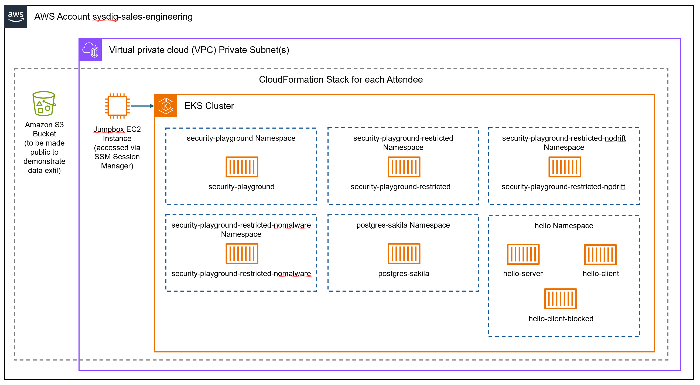

To sign into your environment:

1. Open a web browser and go to https://aws.amazon.com/console/
1. If prompted, choose to sign in with an IAM user (as opposed to the Root user) and enter the AWS Account ID of **sysdig-sales-engineering** 
1. Enter the IAM username and password you were provided and click the **Sign in** button
1. Pick the **Melbourne** region in the drop-down in the upper right of the console
    1. 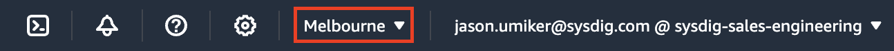
1. Go to the EC2 service's console (you can type EC2 in the Search box on top and then click on the EC2 service in the results)
1. Click on the **Instances (running)** link under **Resources** to be taken to a list of running EC2 Instances 
    1. 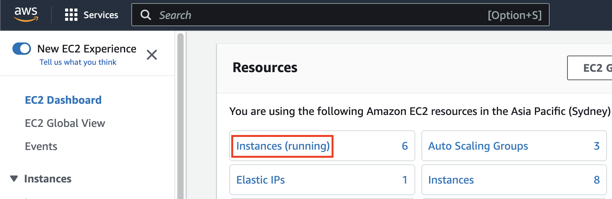
1. In the **Find instance by attribute or tag** search box type **AttendeeXX** (where XX is your attendee number at the end of your username) and press enter/return 
1. Tick the box next to the jumpbox and then click the **Connect** button on top 
    1. 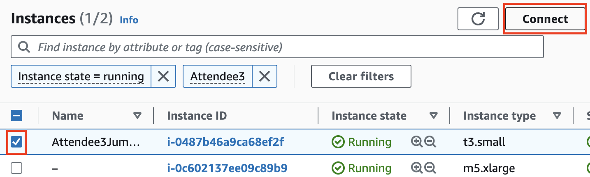
1. Choose the **Session Manager** tab and then click the **Connect** button 
    1. 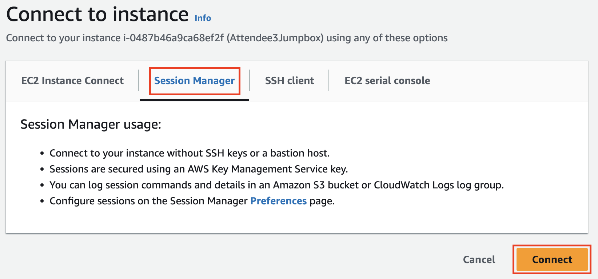
1. Once your terminal window opens type **sudo bash** then `cd ~` (as all of our workshop content is pre-installed in the root user's home directory) 
    1. **NOTE:** if you close and re-open the Session Manager Session/Terminal window then you'll need to rerun those two commands to return to the root user and its home directory.
1. Type **kubectl get pods -A** and you'll see a list of all the running Pods in your EKS cluster.

> **NOTE**: Even though we will refer you to a few example files on GitHub throughout the workshop, everything you need to run has already been pre-installed onto the jumpbox in /root. You don't need to copy/paste or **git clone** anything from GitHub today.

### Sysdig environment

You'll have received a login and password for Sysdig from the facilitator. To sign into your environment:

1. Open a web browser and go to https://sysdig.com
1. Under the Log In dropdown on the top right of the page choose **AWS-AP-Sydney** under **Sysdig Secure** (NOTE: not Sysdig Monitor which we won't be looking at today)
    1. 
1. Enter the email address and password you were provided for Sysdig and click the **Log in** button
1. If you see the Customize your Sysdig experience screen, then click the **Get into Sysdig** button in the lower right hand corner to take you through to the **Home** screen

## Module 1 - Runtime Threat Detection and Prevention (Workload/Kubernetes)

In our first module, we'll be exploring Sysdig's capabilities around detecting - and even preventing - runtime threats.

Regardless of how an attacker gets in, they will do many of the same things - a predictable sequence of things best explained by the [MITRE ATT&CK Framework](https://attack.mitre.org/). Sysdig's threat research team runs a large fleet of honeypots around the world to learn first-hand all the things people do once they get in - and then continually updates our library of [Rules](https://docs.sysdig.com/en/docs/sysdig-secure/policies/threat-detect-policies/manage-rules/) (possible behaviors to look for) and [Managed Policies](https://docs.sysdig.com/en/docs/sysdig-secure/policies/threat-detect-policies/manage-policies/) (which Rules to look for, their severity, and what to do when we find them) on behalf of all of our customers. You can also make your own custom ([Falco](https://falco.org/)) Rules and/or Policies beyond what we offer if you'd like - this is fully transparent and based on opensource tooling/standards rather than a magic black box!

When Sysdig see these Rules (as defined in the Polices) we generates **Events** with all the relevant context in real-time. And we can do so against these sources - with more coming soon such as from other popular cloud/SaaS services:
* Linux kernel System Calls of your Nodes/Containers
* The Kubernetes Audit Trail
* The audit trails of AWS, Azure and GCP
* Okta's audit trail
* GitHub's audit Trail
* MS Entra ID's audit Trail

In addition to our 'traditional' Rules/Policies-based approach, there are three more features that round out our Threat Detection/Prevention capabilities:
* [Container Drift Detection/Prevention](https://docs.sysdig.com/en/docs/sysdig-secure/policies/threat-detect-policies/manage-policies/drift-control/) - we can look for any executables that are introduced at runtime that were not in the container image as it was pulled - as well as optionally block them from running
* Malware Detection/Prevention (Preview) - we can look for Malware (as defined in several threat feeds we watch) that tries to run - as well as optionally block them from running
* [Crypto Mining ML Detection](https://docs.sysdig.com/en/docs/sysdig-secure/policies/threat-detect-policies/manage-policies/machine-learning/) - we have introduced our first Machine Learning enabled detection with a model specifically focused on detecting crypto-mining.

### Simulating an attack to generate Events within Sysdig

1. In the Sysdig UI hover over **Threats** on the left-hand side and click on Kubernetes under Activity
    1. Pick the three hour time range (3H) on the bottom to show only the events you are about to generate. This should start out as empty.
1. So lets's generate some Events!
    1. Click this link to open the (simple yet insecure) code for the security-playground service on your cluster in a new tab - https://github.com/jasonumiker-sysdig/example-scenarios/blob/main/docker-build-security-playground/app.py
        1. This Python app serves a **very** insecure REST API that will return the contents of any file on the filesystem, write any file to the filesystem and/or execute any file on the filesystem in response to simple **curl** commands
            1. And you can combine them to download/write a file then execute it for example
        1. This is simulating a very bad remote code execution (RCE) vulnerability - which could be either with your own code or in a package it uses (e.g. Log4J, Struts, etc.)
            1. As it is detecting what happens when any such vulnerability is being exploited - no matter what or how - that we're interested in here
    1. Go back to the the Session Manager terminal browser tab for your jumpbox
    1. Type **cat ./example-curls.sh** to have a look at a script with some example **curl** commands we are going to run against the security-playground service:
        1. Reading the sensitive path **/etc/shadow**
        1. Writing a file to **/bin** then **chmod +x**'ing it and running it
        1. Installing **nmap** from **apt** and then running a network scan
        1. Running the **nsenter** command to 'break out' of our container Linux namespace to the host
        1. Running the **crictl** command against the container runtime for the Node (bypassing Kubernetes and the Kubelet to manage it directly)
        1. Using the **crictl** command to grab a Kubernetes secret from another Pod on the same Node (that was decrypted to an environment variable there at runtime)
        1. Using the **crictl** command to run the Postgres CLI **psql** within another Pod on the same Node to exfiltrate some sensitive data
        1. Using the Kubernetes CLI **kubectl** to launch another nefarious workload (leveraging our over-provisioned Kubernetes ServiceAccount that for security-playground)
        1. Running a **curl** command against the AWS EC2 Instance Metadata endpoint for the Node from the security-playground Pod
        1. Finally run the xmrig crypto miner
    1. Go ahead and run that script by typing **./example-curls.sh** and watch all the output that is returned from the attacker's perspective.
    1. Note that the Pod is actually killed a little while into the mining triggered by the last curl because the crypto miner (xmrig) tries to use more memory than the limit set for this container (showing another reason it is a good idea to place such limits in your PodSpecs!)
    1. Then go back to the Sysdig UI tab and refresh that tab in your browser
        1. You'll see a circular visualisation/heatmap of which clusters, namespaces and Pods the runtime events we've seen are coming from on the left
        1. And it also gives you either a summary of those events in the **Summary** tab or a full timeline of them in the **Events** tab on the right
        1. 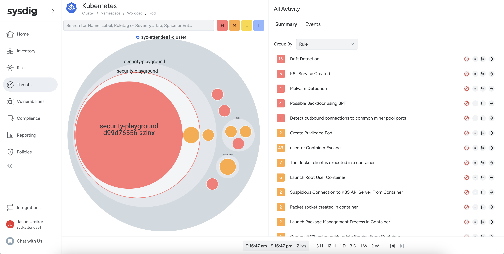
    1. Choose the Events tab on the right
    1. As you can see there are a number of events that Sysdig picked up here - in real-time!
        1. 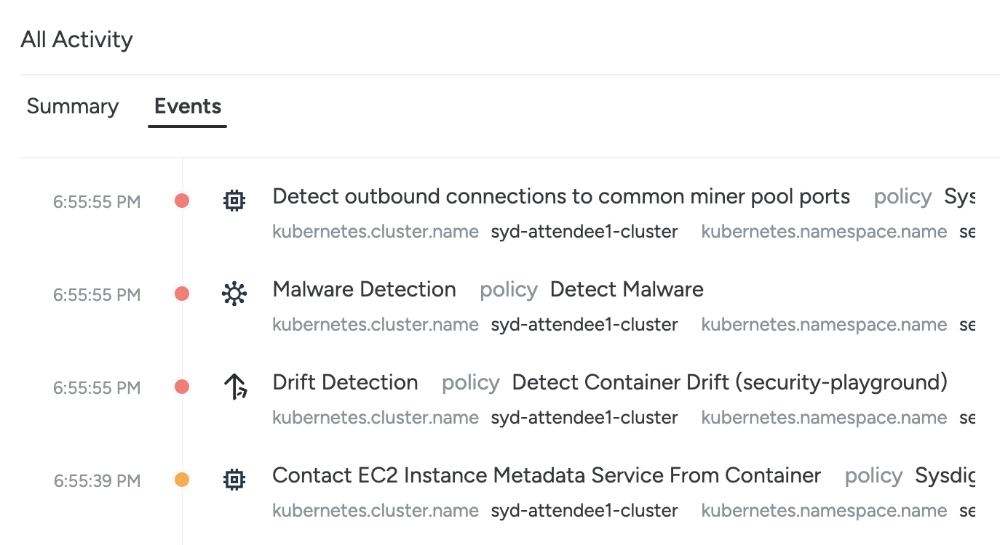
    1. If you click into the the top **Detect outbound connections to common miner pools** and then scroll through it you'll see all the context of that event including details of the process, the network, the AWS account, the Kubernetes cluster/namespace/deployment, the host as well as the container
       1. In particular the process tree view shows us that our Python app (gunicorn) launched a shell that launched the crypto miner xmrig - that looks suspicious!
       1. 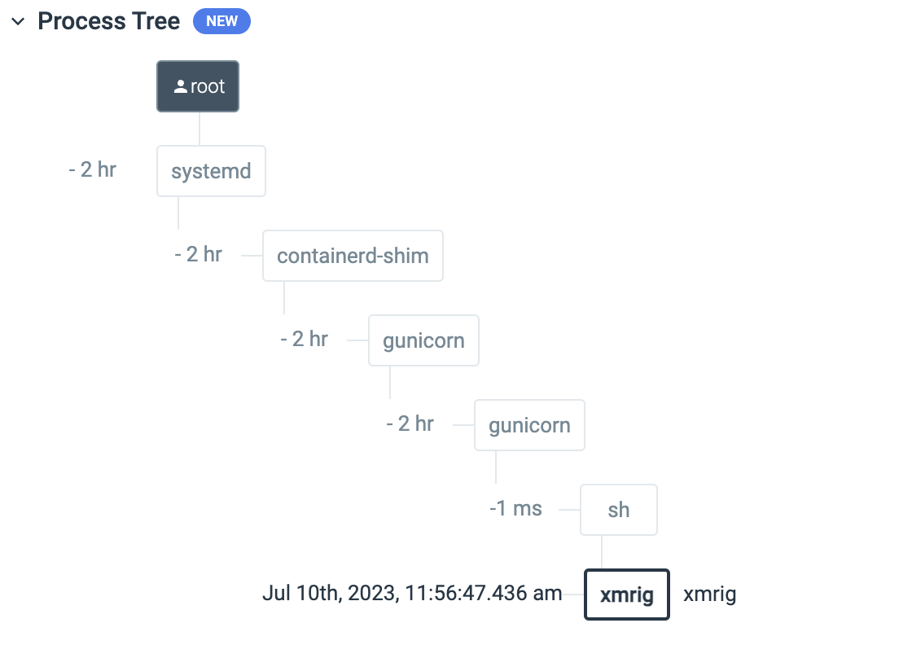
       1. You can also click Explore in order to see a more detailed view of this process tree and the history within this environment
       1. 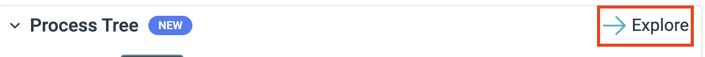
       1. Not only does this view show us all the other Events related to this executable (xmrig) on the right, it shows us all the other things that have been happening - the apt-get's, nmap, nsenter's, etc.
       1. 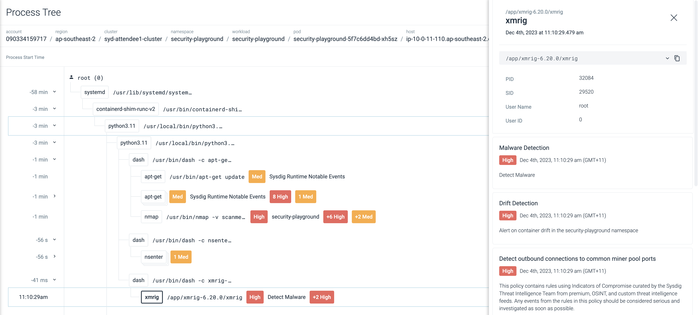
1. Understanding these Events
    1. You should scroll down to the oldest/first Event then click into each to reveal all the detail/context of each. The things that we picked up here include:
        1. **Read sensitive file untrusted** - reading the **/etc/shadow** file which a web service shouldn't be doing
        1. **Drift Detection** - every time an executable was added to the container at runtime (it wasn't in the image) and then it was run
            1. It is not best practice to make changes to containers at runtime - rather you should build a new image and redeploy the service in an immutable pattern
        1. **Launch Package Management Process in Container** - just like with **Drift Detection**, you shouldn't be adding or updating packages in running containers with apt/yum/dnf - but instead do it in your **Dockerfile** as part of the container image build process
        1. **Suspicious network tool downloaded and launched in container** - it is a common early step for attackers to run a scan to try to work out what network the workload they've exploited is in, and thus, what else they can get to
        1. **The docker client is executed in a container** - this fires not just on the **docker** CLI but also other container CLIs such as **crictl** and **kubectl**. 
            1. It is unusual for a container to be trying to talk directly to the container runtime/socket on a Kubernetes cluster - and that you can is actually proof a container escape has happened!
            1. Note that if you expand out the Process section it'll show the commands that were run such as that **psql** that was exfiltrating our data
            1. 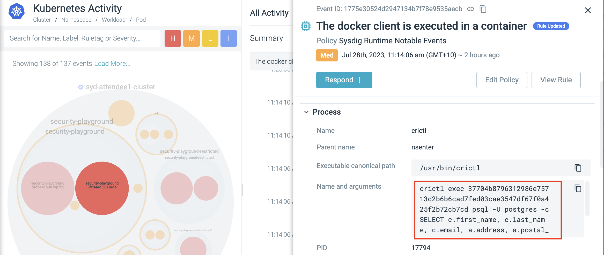
        1. **Contact EC2 Instance Metadata Service From Container** - your EKS Pods should be using other means such as [IAM Roles for Service Accounts (IRSA)](https://docs.aws.amazon.com/eks/latest/userguide/iam-roles-for-service-accounts.html) to interact with AWS. It going through the Node to use its credentials instead is suspicious
        1. **Malware Detection** - we look for many malware filenames and hashes from our threat feeds - including crypto miners such as the **xmrig** here
            1. We can even block malware from running - as you'll see later on!
        1. **Detect outbound connections to common miner pool ports** - we look at network traffic (at Layer 3) and when the destination are suspicious things like crypto miner pools or [Tor](https://www.torproject.org/) entry nodes

And this is only a small sample of the Rules we have out-of-the-box as part of the service!

(Optional) Feel free to copy **example-curls.sh** to a new file and play with generating your own curls if you want to see whether Sysdig will pick up various other things you may want to try!

(Optional) Have a look at all our Managed Policies (go to **Policies** on the left and then **Runtime Policies**) as well as our Rules Library (go to **Policies** then expand out the **Rules** carrot menu and choose **Rules Library**). Drill down into the Falco YAML (noting that this is not a "magic black box" and you can write your own Rules and Policies). Focus on the Policies and Rules that you saw fire in our example.

### Why did this attack work? 

In order for this attack to succeed many things had to be true:
1. Our service was vulnerable to remote code execution - this could be either due to our own code being vulnerable (as was the case here) or an opensource package our app uses (from pip, npm, maven, nuget, etc.) being vulnerable
1. Our service that we were **curl**'ing was running as **root** - so, not only could it read/write everything within the container's filesystem, but it was also root when it escaped out of the container to the host!
1. The PodSpec had [**hostPID: true**](https://github.com/jasonumiker-sysdig/example-scenarios/blob/3da34f8429bd26b82a3ee2f052d2b654d308990f/k8s-manifests/04-security-playground-deployment.yaml#L18) as well as [privileged **securityContext**](https://github.com/jasonumiker-sysdig/example-scenarios/blob/3da34f8429bd26b82a3ee2f052d2b654d308990f/k8s-manifests/04-security-playground-deployment.yaml#L35) which allowed it to escape its container boundary (the Linux namespace it was being run in) to the host and then control that hosts's container runtime (bypassing Kubernetes and the [kubelet](https://kubernetes.io/docs/concepts/overview/components/#kubelet)). That in turn lets it control all the other containers that happened to be running on that Node. 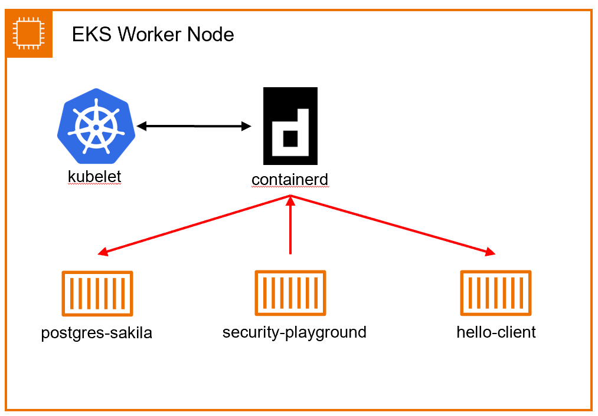
    1. The **nsenter** command lets us switch Linux namespaces - which containers use to isolate us from the other containers. We can only successfully run this if we are root, have hostPID as well as a privileged security context.
    1. The **crictl** command is like the Docker CLI but for containerd (which is the container runtime used these days by Kubernetes Nodes). We can only successfully run this if we are root as well as on the host (such as breaking out with nsenter).
1. The attacker was able to add new executables like **nmap** and the crypto miner **xmrig** to the container at runtime and run them
1. The attacker was able to download those things from the Internet (because this Pod was able to reach everywhere on the Internet via its egress)
1. The ServiceAccount for our service was over-provisioned and could call the K8s API to do things like launch other workloads (which it didn't need).
    1. Run **kubectl get rolebindings -o yaml -n security-playground && kubectl get roles -o yaml -n security-playground** to see that the default ServiceAccount has a Role bound to it with it with the following rules/permissions:
        ```
        rules:
        - apiGroups:
            - '*'
            resources:
            - '*'
            verbs:
            - '*'
        ```
    1. At least it was a Role rather than a ClusterRole - meaning it can only do things with this security-playground Namespace. But there is plenty of damage you can do with just full admin within a Namespace!
1. The attacker was able to reach the EC2 Metadata endpoint (169.254.0.0/16),  which is intended just for the EKS Node, from within the Pod

These are all things we can fix:
* Some with how our workload is configured (which Kubernetes can now enforce for us with the new [Pod Security Admission](https://kubernetes.io/docs/concepts/security/pod-security-admission/))
* Some with Sysdig Secure's Container Drift prevention
* And the rest with controlling egress network access to the Internet

And, if we do all three, then we could have prevented the **entire** attack (rather than just detecting it) - even with the workload in question *still* having this critical remote code execution vulnerability (which we should also fix too)!

### How to fix this workload (security-playground)

For each of the causes above - these are the solutions:
1. To fix the vulnerabilities in our case here, we can use a Static application security testing (SAST) product to identify our insecure code. Our partners like [Snyk](https://snyk.io/product/snyk-code/) and [Checkmarx](https://checkmarx.com/cxsast-source-code-scanning/) can help here. 
    1. 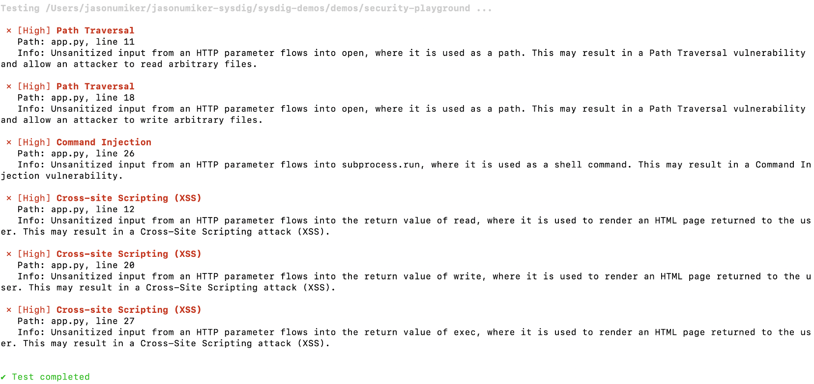
    1. Alternatively, if this was based on a known/public CVE within the app/container (such as Log4J etc.) instead, Sysdig's Vulnerability Management (which we'll explore in a future Module) would have detected it and let us know to patch either the base layer of our container or the code package to an updated version without the vulnerability
1. In order to run this container as non-root we actually need to change the Dockerfile in the following ways. Here is the [Dockerfile](https://github.com/jasonumiker-sysdig/example-scenarios/blob/main/docker-build-security-playground/Dockerfile) before these changes - and [here](https://github.com/jasonumiker-sysdig/example-scenarios/blob/main/docker-build-security-playground/Dockerfile-unprivileged) it is after.
    1. We need to [add a user and group to use](https://github.com/jasonumiker-sysdig/example-scenarios/blob/main/docker-build-security-playground/Dockerfile-unprivileged#L3) as part of the docker build
    1. We need to [specify in the Dockerfile to run as that User by default](https://github.com/jasonumiker-sysdig/example-scenarios/blob/main/docker-build-security-playground/Dockerfile-unprivileged#L8) (note this is just the default and can be overridden at runtime - unless a restricted PSA or other admission controller blocks that)
    1. We need to put our app in a folder that user/group has permissions to read and execute (and perhaps write to as well) - [in this case we use our new user's home directory](https://github.com/jasonumiker-sysdig/example-scenarios/blob/main/docker-build-security-playground/Dockerfile-unprivileged#L9) as opposed to the original /app
    1. There was a great talk about building least privilege containers from the recent KubeCon Europe that goes much deeper here - https://youtu.be/uouH9fsWVIE
1. We just need to remove the insecure options from our PodSpec. But we also need to, ideally, prevent people from putting those sorts of options in them as well.
    1. There is now a feature built-in to Kubernetes (which GAed in 1.25) to enforce that they don't - [Pod Security Admission](https://kubernetes.io/docs/concepts/security/pod-security-admission/).
        1. This works by [adding labels onto each Namespace](https://kubernetes.io/docs/tasks/configure-pod-container/enforce-standards-namespace-labels/). There are two standards that it can warn about and/or enforce for you - baseline and restricted.
            1. [baseline](https://kubernetes.io/docs/concepts/security/pod-security-standards/#baseline) - this prevents the worst of the parameters in the PodSpec such as hostPid and Privileged but still allows the container to run as root
            1. [restricted](https://kubernetes.io/docs/concepts/security/pod-security-standards/#restricted) - this goes further and blocks all insecure options including running as non-root
    1. And Sysdig has a Posture/Compliance feature that can help both catch the IaC before it is deployed as well as remediate any issues at runtime - which we'll look at in a future Module.
1. We can block the execution of any new scripts/binaries added at runtime with Container Drift (in this case we only had it detecting not preventing Drift)
1. We can limit the egress access of Pod(s) to the Internet via either Kubernetes NetworkPolicy (which we cover in a future Module) or by making each thing go through an explicit authenticated proxy to reach the Internet with an allow-list of what that service is able to reach etc.
1. We can remove the Role and RoleBinding to the Kubernetes API by our default ServiceAccount that lets it have unnecessary access to to the Kubernetes API.
1. We can either block egress access for the Pod to 169.254.0.0/16 via NetworkPolicy as described above and/or ensure a maximum of 1 hop with IDMSv2 as AWS describes in their documentation - https://docs.aws.amazon.com/whitepapers/latest/security-practices-multi-tenant-saas-applications-eks/restrict-the-use-of-host-networking-and-block-access-to-instance-metadata-service.html

### Seeing the fixes in action
We have an example workload where 1-3 of **Why did this attack work** have been fixed running as well - **security-playground-unprivileged**. It was built with our new non-root Dockerfile and it is running in the security-playground-restricted Namespace where a PSA is enforcing a restricted security standard (meaning it can't run as root or have the options such as hostPID or privileged SecurityContext to allow for container escapes). You can see the labels on this namespace implementing the PSA by running **kubectl describe namespace security-playground-restricted** - note the **pod-security** Labels.

You can see the original Kubernetes PodSpec [here](https://github.com/jasonumiker-sysdig/example-scenarios/blob/main/k8s-manifests/04-security-playground-deployment.yaml) and the updated one with all the required changes to pass the restricted PSA [here](https://github.com/jasonumiker-sysdig/example-scenarios/blob/main/k8s-manifests/07-security-playground-restricted-deployment.yaml).

To see how our attack fares with 1-3 fixed run **./example-curls-restricted.sh** (it is the same as the last file just pointed at the different port/service for security-playground-restricted). You'll note:
* Anything that required root within the container (reading /etc/shadow, writing to /bin, installing packages from apt, etc.) fails with a **500 Internal Server Error** because our Python app didn't have permissions to do it.
* Without **root**, **hostPid** and **privileged** it couldn't escape the container
* The only things that worked were hitting the Node's EC2 Metadata endpoint and downloading/running the xmrig crypto miner into the user's home directory (where it still had rights to do so.)

If we also add in Sysdig enforcing that any Container Drift is prevented (that no new executables added at runtime can be run), then that blocks *everything* but the EC2 Instance Metadata access (which we'll block with NetworkPolicies in a future Module). To see that: 
* Go to **Policies** -> **Runtime Policies** and then look at **security-playground-restricted-nodrift** - Note that rather than just detecting drift (as in the other Namespaces) we are blocking it if the workload is in the **security-playground-restricted-nodrift** Namespace
    * And we have a another copy of our security-playground-restricted service running there on a different HostPort
* Run **./example-curls-restricted-nodrift.sh** which runs all those same curls but against a workload that is both restricted like the last example but also has Sysdig preventing Container Drift (rather than just detecting it)
    1. If you look at the resulting Events in our Threats UI you'll see the Drift was **prevented** rather than just detected this time
    1. 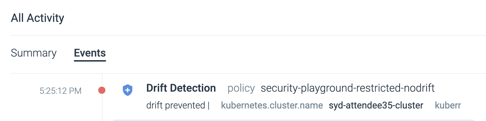

And, we also can now block instead of just detecting Malware.
To see that: 
* Go to **Policies** -> **Runtime Policies** and then look at **security-playground-restricted-nomalware** - Note that rather than just detecting malware (as in the other Namespaces) we are blocking it if the workload is in the **security-playground-restricted-nomalware** Namespace
    * And we have a another copy of our security-playground-restricted service running there on a different HostPort
* Run **./example-curls-restricted-nomalware.sh** which runs all those same curls but against a workload that is both restricted but also has Sysdig preventing malware (rather than just detecting it) (but not blocking Container Drift - as we want to show that the malware tries to run so we can block it with that)
    1. If you look at the resulting Events in our Threats UI you'll see the Malware was **prevented** from running rather than just detected this time
    1. 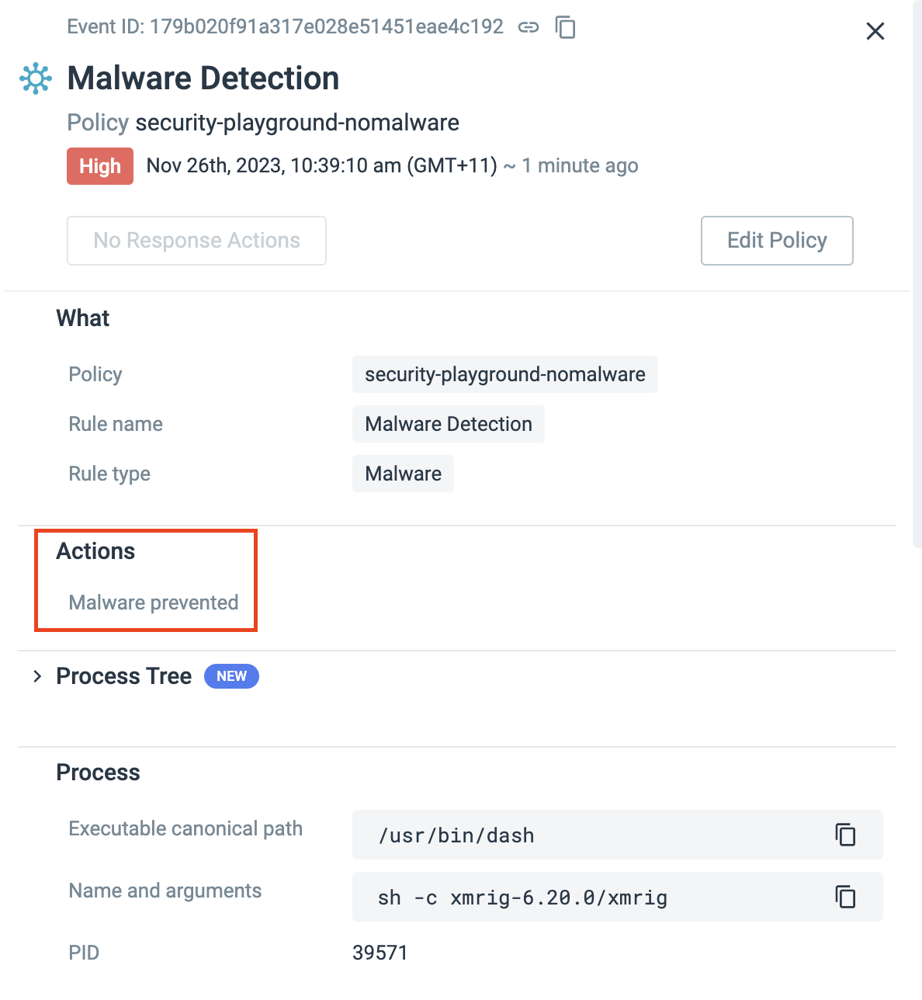

So, as you can see, a combination of fixing the posture of the workload as well as Sysdig's Container Drift and Malware Detection goes a **long** way to preventing so many common attacks - even against workload with such critical vulnerabilities!

One last thing you can try is to test trying to change security-playground-restricted to undermine its security like security-playground. Run the following command to try to deploy the insecure container image and PodSpec to that namespace **kubectl apply -f security-playground-test.yaml**. Note how we're warned that is not allowed in the **security-playground-restricted** Namespace due to the restricted PSA in place there. Even though it let the Deployment create - you'll note that it (actually its ReplicaSet) is unable to actually launch the Pods.
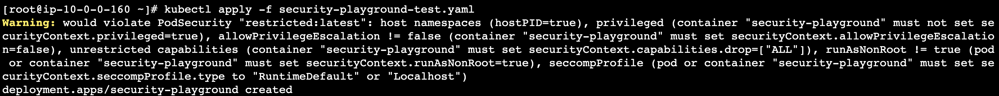

Run **kubectl events security-playground -n security-playground-restricted** to see the Pod creation failures.

This is why blocking at runtime with PSAs are a bit of a blunt instrument - you should also let people know earlier/lefter in the pipeline that this is going to happen (and they need to fix the PodSpecs) rather than have them scratch their head on why their pods are not launching at run/deploy time.

This table summarises our experiments in fixing this workload:
|Exploit in the example-curl.sh|example-curl|security-playground|security-playground-restricted|security-playground-restricted + container drift enforcement|security-playground-restricted + malware enforcement|
|-|-|-|-|-|-|
|1|Reading the sensitive path /etc/shadow|allowed|blocked (by not running as root)|blocked (by not running as root)|blocked (by not running as root)|
|2|Writing a file to /bin then chmod +x'ing it and running it|allowed|blocked (by not running as root)|blocked (by not running as root)|blocked (by not running as root)|
|3|Installing nmap from apt and then running a network scan|allowed|blocked (by not running as root)|blocked (by not running as root)|blocked (by not running as root)|
|4|Running the nsenter command to 'break out' of our container Linux namespace to the host|allowed|blocked (by not running as root and no hostPID and no privileged securityContext)|blocked (by not running as root and no hostPID and no privileged securityContext)|blocked (by not running as root and no hostPID and no privileged securityContext)|
|5|Running the crictl command against the container runtime for the Node|allowed|blocked (by not running as root and no hostPID and no privileged securityContext)|blocked (by not running as root and no hostPID and no privileged securityContext)|blocked (by not running as root and no hostPID and no privileged securityContext)|
|6|Using the crictl command to grab a Kubernetes secret from another Pod on the same Node|allowed|blocked (by not running as root and no hostPID and no privileged securityContext)|blocked (by not running as root and no hostPID and no privileged securityContext)|blocked (by not running as root and no hostPID and no privileged securityContext)|
|7|Using the crictl command to run the Postgres CLI psql within another Pod on the same Node to exfiltrate some sensitive data|allowed|blocked (by not running as root and no hostPID and no privileged securityContext)|blocked (by not running as root and no hostPID and no privileged securityContext)|blocked (by not running as root and no hostPID and no privileged securityContext)|
|8|Using the Kubernetes CLI kubectl to launch another nefarious workload|allowed|blocked (by ServiceAccount not being overprovisioned)|blocked (by ServiceAccount not being overprovisioned and Container Drift Enforcement preventing kubectl being installed)|blocked (by ServiceAccount not being overprovisioned)|
|9*|Running a curl command against the AWS EC2 Instance Metadata endpoint for the Node from the security-playground Pod|allowed|allowed|allowed|allowed|
|10|Run the xmrig crypto miner|allowed|allowed|blocked (by Container Drift Enforcement blocking xmrig from being installed)|blocked (by Malware Enforcement)

*And 9 can be blocked by NetworkPolicy and/or limitations of IDMSv2 to 1 hop. We'll do that in the future NetworkPolicy Module.

## Module 2 - Runtime Threat Detection and Prevention (Cloud/AWS)

Sysdig's Runtime Threat Detection is not limited to your Linux Kernel Syscalls and Kubernetes Audit trail - it can also do agentless runtime threat detection against AWS CloudTrail (as well as Azure, GCP, Okta, Entra ID and GitHub - with more coming all the time)! When we say agentless, we mean that the Falco watching your CloudTrail is run by Sysdig in our SaaS backend for you. You optionally *could* run an agent in your account called the [Cloud Connector](https://docs.sysdig.com/en/docs/installation/sysdig-secure/connect-cloud-accounts/aws/agent-based-with-ciem/) as well - but most customers now prefer that Sysdig does this for them as-a-service without an agent.

Let's have a quick look at an AWS CloudTrail detection - and why covering both your EKS and AWS environments is important.

### AWS IAM Roles for Service Accounts (IRSA)
AWS EKS has a mechanism for giving Pod's access to the AWS APIs called [IAM Roles for Service Accounts (IRSA)](https://docs.aws.amazon.com/eks/latest/userguide/iam-roles-for-service-accounts.html). In short, this binds a particular service account in Kubernetes to an IAM Role in AWS - and will automatically mount credentials for using that AWS IAM role into any Pods that use that Kubernetes service account at runtime.

We've prepared an IRSA mapping already - the **irsa** ServiceAccount in the **security-playground** Namespace is bound to an AWS IAM Role that has the **Action": "s3:*"** policy applied for an S3 bucket for your Attendee in this account. If you run the command below you'll see an Annotation on the ServiceAccount with the ARN of that IAM Role:
**kubectl get serviceaccount irsa -n security-playground -o yaml**

It has the following in-line policy - one which we commonly see which is a * for the s3 service (really two to cover the bucket itself as well as the contents). It is properly scoped down to a single bucket Resource, which is better than nothing, but you'll see why a * for this service is a bad idea.

```
{
    "Version": "2012-10-17",
    "Statement": [
        {
            "Action": "s3:*",
            "Resource": "arn:aws:s3:::attendeestack1-bucket83908e77-1d84qdfaymy9u",
            "Effect": "Allow"
        },
        {
            "Action": "s3:*",
            "Resource": "arn:aws:s3:::attendeestack1-bucket83908e77-1d84qdfaymy9u/*",
            "Effect": "Allow"
        }
    ]
}
```

You'll also note that, if you look at the trust relationships of the IAM Role in the AWS Console, you'll see that this role can be only be assumed by the **irsa** ServiceAccount in the **security-playground** Namespace within the EKS cluster that has been assigned this particular unique OIDC provider for AWS IAM to integrate with.

```
{
    "Version": "2012-10-17",
    "Statement": [
        {
            "Effect": "Allow",
            "Principal": {
                "Federated": "arn:aws:iam::090334159717:oidc-provider/oidc.eks.ap-southeast-2.amazonaws.com/id/25A0C359024FB4B509E838B84988ABB0"
            },
            "Action": "sts:AssumeRoleWithWebIdentity",
            "Condition": {
                "StringEquals": {
                    "oidc.eks.ap-southeast-2.amazonaws.com/id/25A0C359024FB4B509E838B84988ABB0:aud": "sts.amazonaws.com",
                    "oidc.eks.ap-southeast-2.amazonaws.com/id/25A0C359024FB4B509E838B84988ABB0:sub": "system:serviceaccount:security-playground:irsa"
                }
            }
        }
    ]
}
```

### The Exploit
If we install the AWS CLI into our container at runtime and run some commands we'll see if our Pod has been assigned an IRSA role and they succeed. There is an **example-curls-bucket-public.sh** file in /root - have a look at that with a **cat example-curls-bucket-public.sh** then run it with **./example-curls-bucket-public.sh**

The install of the AWS CLI succeeds but the S3 changes fail as we don't have that access. We have an updated manifest for the security-playground Deployment that will use this **irsa** ServiceAccount instead of the **default** one we have been using. Apply that by running **kubectl apply -f security-playground-irsa.yaml** to apply that change. Now re-run **./example-curls-bucket-public.sh** and this time they will work!

If you look at this bucket in the S3 console you'll see that it (and all of its contents) is now public (and can be downloaded/exfiltrated by the attacker right from the S3 public APIs)!
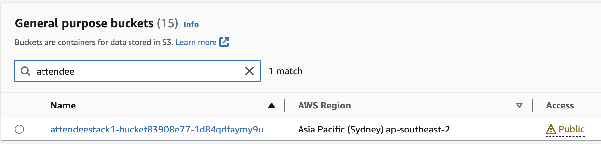

This is because when you assign an AWS IAM Role to a Pod via things like IRSA it means that, if somebody can break out of your app with a remote code execution vulnerability, they can do anything that IAM Role can do within the runtime context of that Pod.

### The Sysdig Detections

On the host side you'll see many **Drift Detections** which will include the commands being run against AWS - and which we could have blocked rather than just detected with Container Drift. This is a good reason to not include CLIs like the AWS one in your images as well! 

But on the AWS API side (go to Threats -> Cloud Activity) you'll see that the protections against this bucket being made public were removed as well as the new Bucket Policy (making them public) were subsequently applied as well!

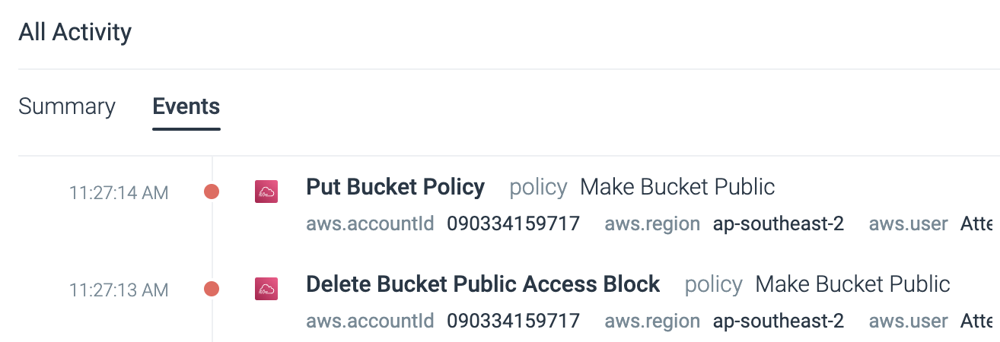
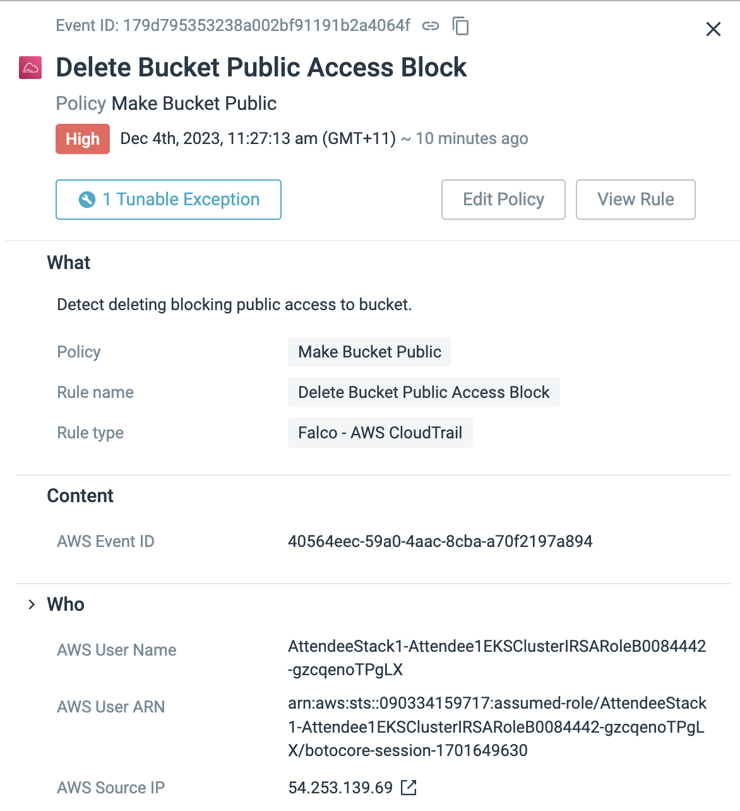

> **NOTE**: As this is all within one region of one AWS account you'll see that, unlike the Kubernetes events, you'll see the events for the other attendees as well. While we do offer a filter based on AWS Tags (in addition to AWS account and region), unfortunately CloudTrail doesn't include the Tags of the resource(s) involved in the trail - and so it isn't currently possible to filter these down with enough granularity where you can only see your own Events. The AWS Tag filter does apply to Inventory/Compliance though.

### How to prevent this attack / fix this workload

This IRSA example could have been prevented with:
* Being more granular and least-privilege with your IRSA's policy to not use s3* and therefore allow the removal of public blocks or applying Bucket Policies (just reading/writing files etc.)
    * This is where things like [Permission Boundaries](https://docs.aws.amazon.com/IAM/latest/UserGuide/access_policies_boundaries.html) and [Service Control Policies (SCPs)](https://docs.aws.amazon.com/organizations/latest/userguide/orgs_manage_policies_scps.html) can be helpful too in ensuring that Roles don't get created that are this over-privileged. 
    * 
* Enforcing Container Drift with Sysdig so the AWS CLI isn't able to be downloaded/run at runtime (as long as you also ensure it also isn't in your images)

Either would have prevented it in our example but, ideally, you'd do both things - for extra protection!

## Module 3 - Host and Container Vulnerability Management

Sysdig has an integrated solution for both (Linux) host as well as container vulnerabilities which scans for known CVEs in your pipelines, your registries as well as at runtime. And, when when we do it at runtime, the added context we bring to it really can help you to route and prioritise things!

### Runtime Vulnerability Scanning
To explore Sysdig's runtime vulnerability scanning:
1. Go to the Sysdig browser tab and go to **Vulnerabilities** on the left and then **Runtime** under Findings.
    1. This is a list of all of the running containers in your environment within the last 15 minutes as well as all the hosts/Nodes that our agent is installed on
    1. It is automatically sorted by severity for you - so the container image on top is the most important to fix (based on the quantity and severity of the In Use vulnerabilities)
    1. 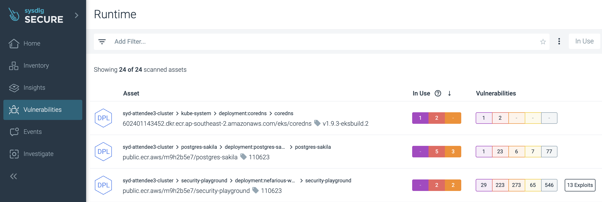
1. Click on the top container/vulnerability and then examine the top you'll see:
    1. The image and tag in question - we know this is running now
    1. The runtime context including the deployment, namespace and cluster it is running on - this is often useful in routing the remediation work to the right team(s)
    1. 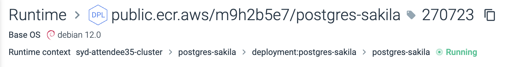
1. Click the **Vulnerabilities** tab - this is a list of all of the Vulnerabilities we found in the image
    1. 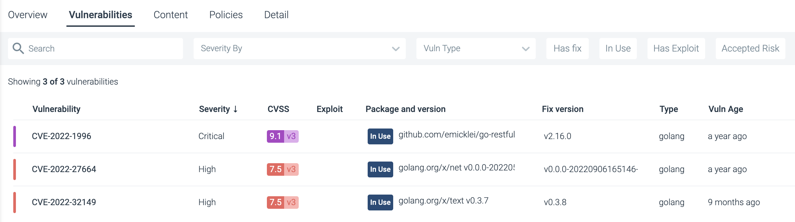
1. Click on one of the CVEs and note all of our details on where we learned about this vulnerability and any fixes or known exploits we know for it
    1. 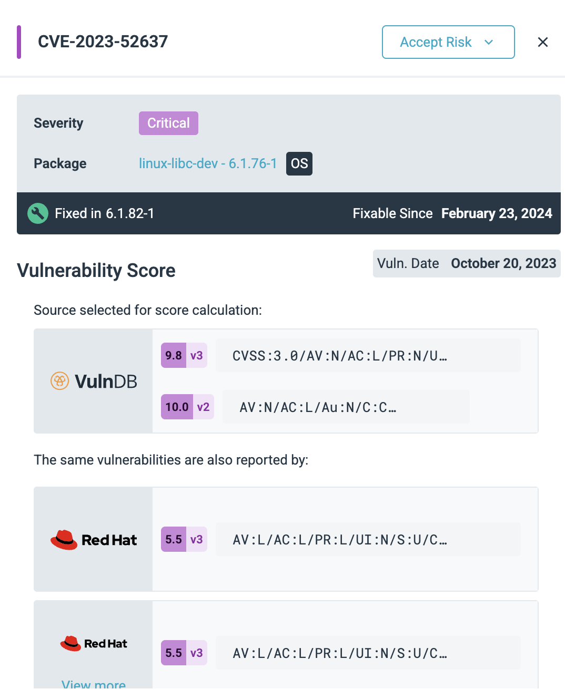
1. Close that vulnerability detail pane
1. Click on the **In Use** filter button - this excludes all the vulnerabilities that we have never seen run (and therefore are much less likely to be exploitable).
1. Click on the **Has fix** button - this excludes those vulnerabilities that do not yet have a new version with a fix available (and therefore your team can't patch them yet)
    1. What we are left with is those vulnerabilities that are actually running (not just in the image) **and** for which there is a fix. This is a more reasonable and prioritized patching task to give somebody!
    1. 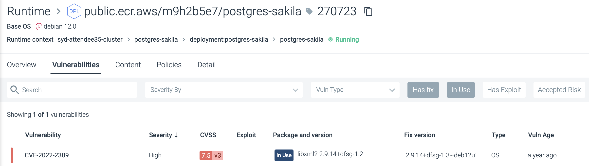

### Pipeline vulnerability scanning

To scan container images for vulnerabilities before they hit a registry, much less a running environment, we have our command-line scanning tool. This can be run anywhere from a developer laptop to a pipeline. If a scan fails (and it is configurable by granular policies under what conditions it'll pass vs. fail) our return code will be non-zero so your pipeline can, in turn, fail that stage until it is fixed.

Here are the instructions for how to install and run our vulnerability CLI scanner - https://docs.sysdig.com/en/docs/installation/sysdig-secure/install-vulnerability-cli-scanner/.

We have already installed it on your jumpbox for you. You can run a scan of the image **logstash:7.16.1** which is an image that has Log4J in it by running the following command:

**./sysdig-cli-scanner -a https://app.au1.sysdig.com logstash:7.16.1**

Not only do you get that output into your build logs for the pipeline stage, but you can also explore the results the Sysdig SaaS UI by following that link listed in the output or going to **Vulnerabilities** -> **Pipeline** in the UI. Note that this is missing the runtime context (as, since it was scanned in a pipeline, and we don't yet know that runtime context).

We also have the [capability to scan images in your registries](https://docs.sysdig.com/en/docs/installation/sysdig-secure/install-registry-scanner/) - but we won't explore that in this workshop.

## Module 4 - Kubernetes Posture/Compliance (i.e. fixing misconfigurations)

As we learned in Module 1, it is very important that your Kubernetes/EKS clusters and the workloads on them are properly configured. This is referred to as either Posture or Compliance - as it is about your posture (all of your configuration(s) when taken together) and whether they are compliant with various standards/benchmarks. 

Sysdig can ensure you are compliant with many common standards such as CIS, NIST, SOC 2, PCI DSS, ISO 27001 - and many more. To see the whole current list you can go to **Policies** on the left then **Policies** again under the **Posture** heading.

The Center for Internet Security (CIS) publishes a security benchmark for many common resources - including EKS. Learn more at https://www.cisecurity.org/benchmark/kubernetes. We'll be looking at your cluster and its workloads to see if they are compliant with that standard in this module.

1. Go to the Sysdig tab in your browser
1. Hover over **Compliance** on the left navigation pane and then click **Overview**
1. We have used our [Team and Zone-based authorization](https://docs.sysdig.com/en/docs/sysdig-secure/policies/zones/) so that your Team can only see your own cluster/Zone.
1. Click on the **CIS Amazon Elastic Kubernetes Service Benchmark** under your heading (this is the only compliance standard we've set against your Zone here - but we have many others such as NIST, SOC2, PCI-DSS, etc.)
    1. 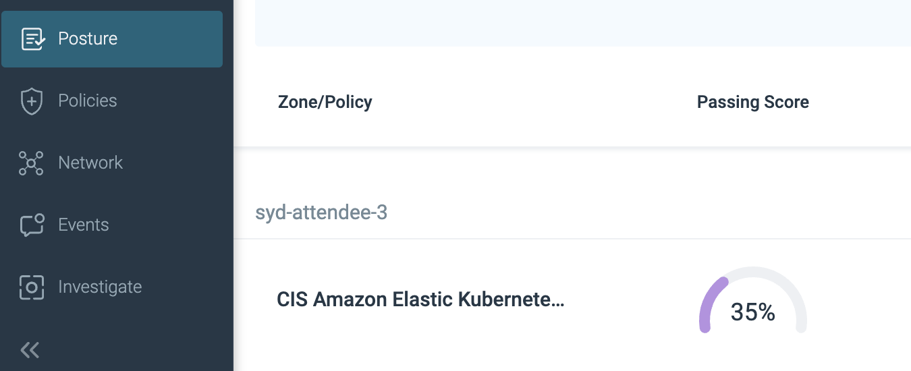
1. There are some controls here that would have prevented our attack. 
1. If you click into the **Show Results** link for each you'll see the list of failing resources then you can click **View Remediation** next to the **security-playground** Resource to see the Remediation instructions:
    1. 4.2.6 Minimize the admission of root containers
        1. Container with RunAsUser root or not set
        1. Container permitting root
    1. 4.2.1 Minimize the admission of privileged containers
        1. Container running as privileged
    1. 4.1.5 Ensure that the default service accounts are not actively used
        1. Access granted to "default" account directly
    1. 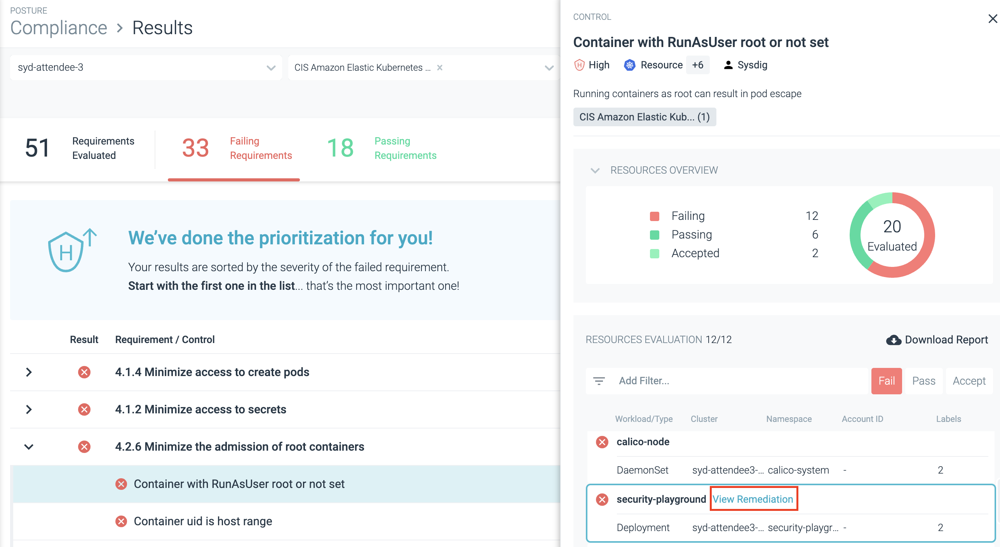
    1. 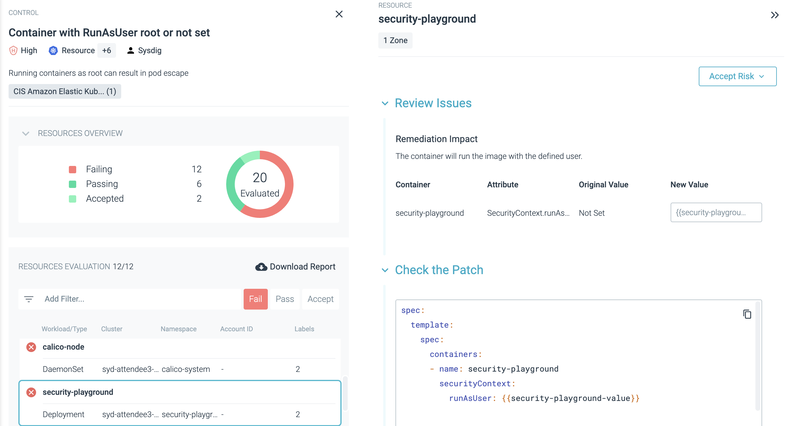

If these settings for **security-playground** were configured to be passing CIS' EKS Benchmark, then it would be just like the **security-playground-unprivileged** workload which, as we saw, fared **much** better in our attack.

And, in addition to helping you to remediate any security issues with your workload(s) and cluster(s), this tool will help you to prove to your auditors that they are compliant with any standards you need to adhere to as well.

There is another view of the same data which may prove more useful in many situations - **Inventory**. 

This is the same information but from the perspective of the resource rather than from the compliance standard - meaning that the Compliance view is "show me what is passing or failing the standard" whereas the Inventory view is "show me how my resource is doing against the standard(s) applied to it (by the Zone)".

Here we are looking at the security-playground deployment and seeing how it is doing first for its posture.
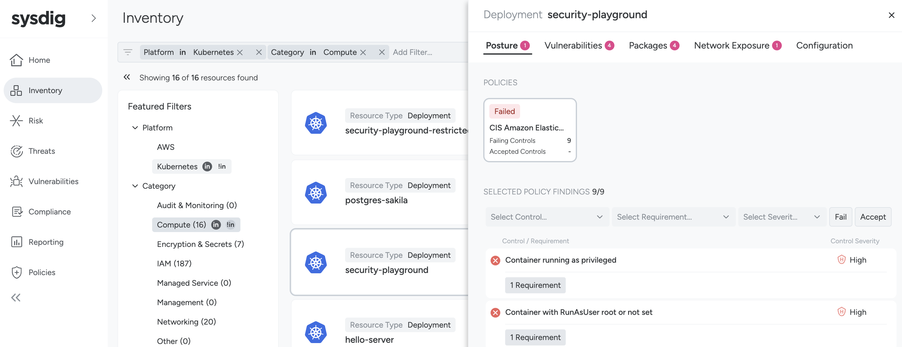

You can even click through to the same remediation steps right in this view too (hover your mouse over the control to see View Remediation).
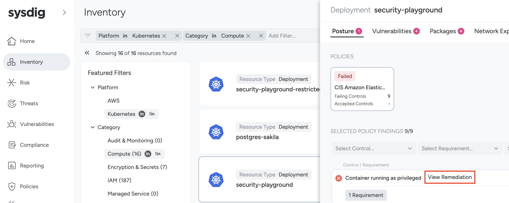
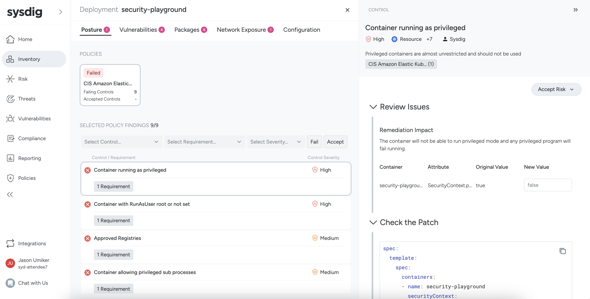

Finally, one of the common things we are is "How can I see what workloads have a particular CVE?" This filter is not possible in the Vulnerability section (those filters are more about the workloads than the vulnerabilities) - but it is possible here in Inventory. Put in a filter for **Vulnerability in CVE-2023-45853** as an example.
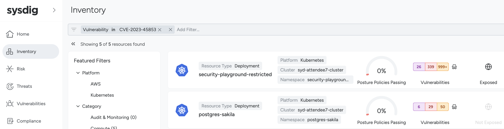

And, as a reminder, you all are in one Sysdig account but are only seeing your own clusters/workloads. So this is something we can easily restrict via our built-in Authorization (via Zones tied to Teams) so that people will only see as much or as little of the environment in Sysdig as you'd like.

### Scanning your IaC in your pipeline(s) (DevSecOps / Shifting Left)

It is also possible to use the same Sysdig CLI scanner we used to scan for container image vulnerabilities to also scan your Infrastructure as Code (by adding a --iac) to ensure that is secure before deploying it.

In order to do so you can run the following command:
```
./sysdig-cli-scanner --apiurl https://app.au1.sysdig.com --iac example-scenarios/k8s-manifests/04-security-playground-deployment.yaml
```

You could add this as a stage of a pipeline or as a git merge test where, if the scan failed, it would stop the pipeline/merge until the security misconfigurations were resolved. 

Setting up such pipeline scans/gates is often referred to as "shifting left" (further into the development stages/lifecycle) or "DevSecOps".

## Module 5 - Risks and Attack Path

So far we explored each of these capabilities (Runtime Threat Detection, Vulnerability Management and Posture Management) separately in their own UIs. But Sysdig is a comprehensive Cloud Native Application Protection Platform (CNAPP) - which means that we bring these all capabilities and all this data together to help you to visualize and prioritise with the full context end-to-end.

Where we do that in the product is in Risks.

If you go to Risks on the left side you'll see this:
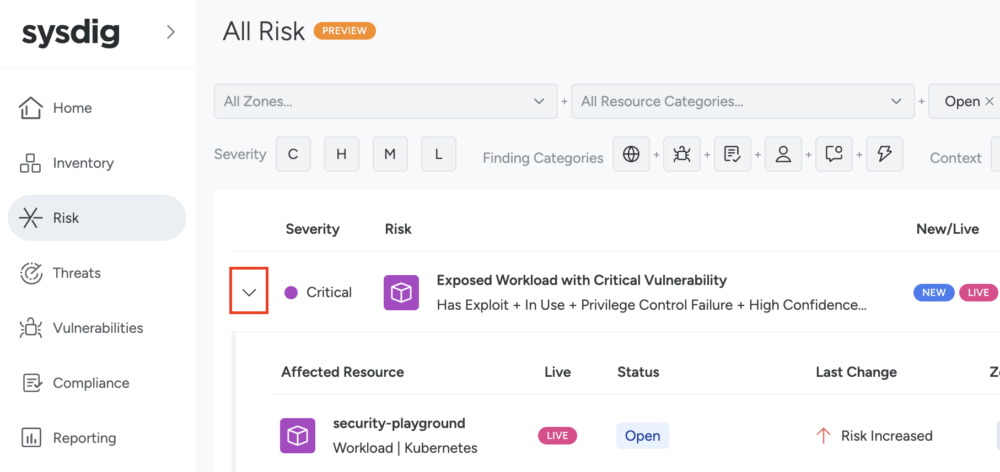
You can expand out the carrot to see more details. The fact that we see the Live icon shows that this is an active risk (that not only does it have insecure configurations and/or critical vulnerabilities but we see recent critical Events that these might be getting exploited now). And you see that this includes all of the categories:
* It is exposed (in this case outside the Kubernetes cluster)
* It has critical vulnerabilities
* It has insecure configurations
* And it has events where risky behavior has already been detected

We can drill in even deeper by clicking on it. Here we see a smaller version of the attack path visualisation. Let's see a bigger one by clicking Explore in the upper right:
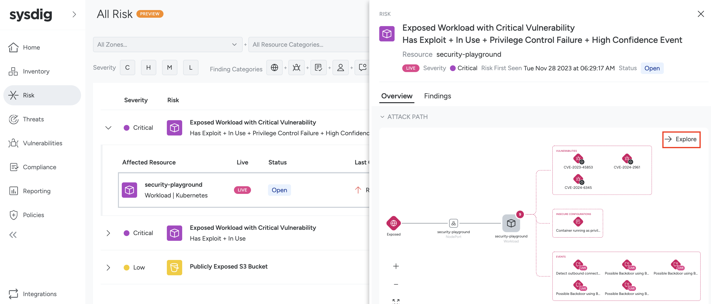. 

Here you can see all of the data Sysdig has about the security-playground workload but all brought together in one visualisation. And that, while any of these things are bad, the fact that this workload has all of them makes it a Critical Risk to prioritise.

Once we are in the larger Attack Path visualisation we can click on any of the icons to drill down and go deeper into that - and maybe even resolve it right from this UI:
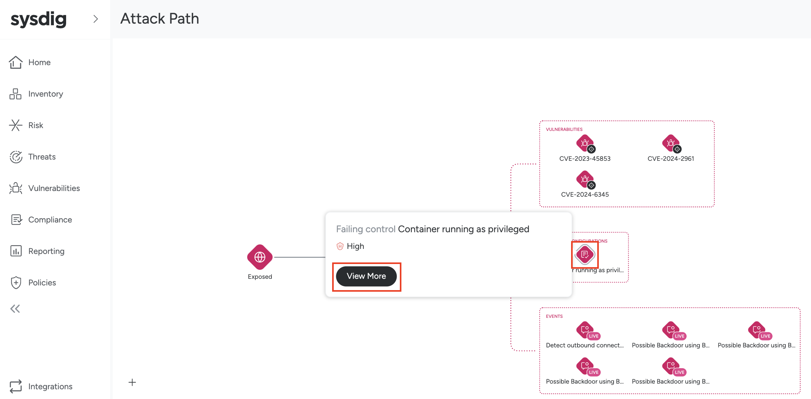
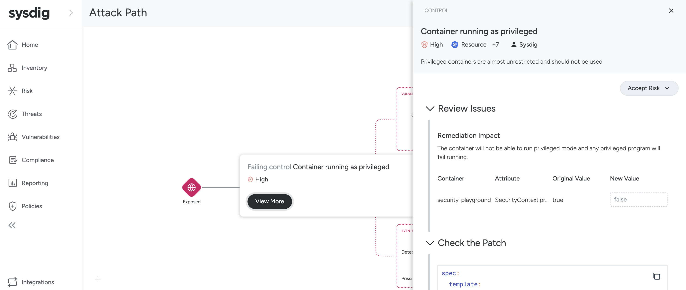

## Module 6 - Kubernetes native firewall (NetworkPolicies)

Kubernetes has a built-in firewall which you configure through YAML documents called [NetworkPolices](https://kubernetes.io/docs/concepts/services-networking/network-policies/). These can have rules not just based on IPs or CIDR blocks/ranges - but based on Kubernetes Namespaces and Labels. This is much more dynamic and easier to manage!

It is not enabled out-of-the-box on many Kubernetes distributions/offerings including EKS. For EKS, you need to [set a configuration option on their CNI cluster Add-on](https://docs.aws.amazon.com/eks/latest/userguide/cni-network-policy.html) (which we've done for you here today). These CNI providers basically configure a local firewall on each and every Kubernetes Node - and update them continually across all the Nodes to enforce the NetworkPolicies as required.

Even after installing/configuring a CNI to be able to enforce NetworkPolicies there aren't any by default - so every Pod can talk to every other Pod by default. So, you need to implement policies to restrict that traffic - with the most secure option being to flip to a default-deny and then specifically allow *everything* that is required. This can be a bit daunting adding them to existing environments as you'll worry that they make break things. This is where Sysdig can help.

### Using Sysdig to discover your traffic and generate NetworkPolicies

Sysdig's keeps track of all the network flows and works out the Kubernetes context/labels of everything involved. This allows us to show you the traffic we've seen as well as help you generate NetworkPolicies that would allow only that traffic. In our UI you can untick things we've seen if you don't want to allow them as well.

To explore this feature:
1. Run **./example-curls-networkpolicy.sh** and see how our security-playground Pod can reach hello-server (which is running in a different Kubernetes Namespace)
1. Open the Sysdig tab in your browser
1. Go to **Network** on the left
1. Pick your EKS cluster as well as the Namespace **hello** and the type **Service**
    1. 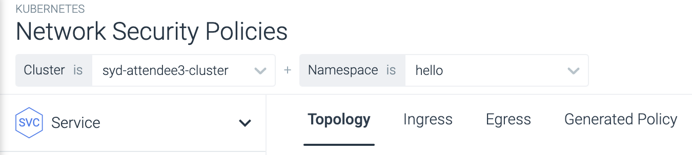
1. In the right-hand pane we can see that that the hello Namespace consists of:
    1. A backend that is made up of a service named hello-server and a deployment named hello-server
    1. Two frontend apps called hello-client and hello-client-blocked that talk to the hello-server backend service
    1. We can also see that our security-playground services were connecting to the backend as well (as there was a **curl** to do so in the exploit scripts we ran)
    1. 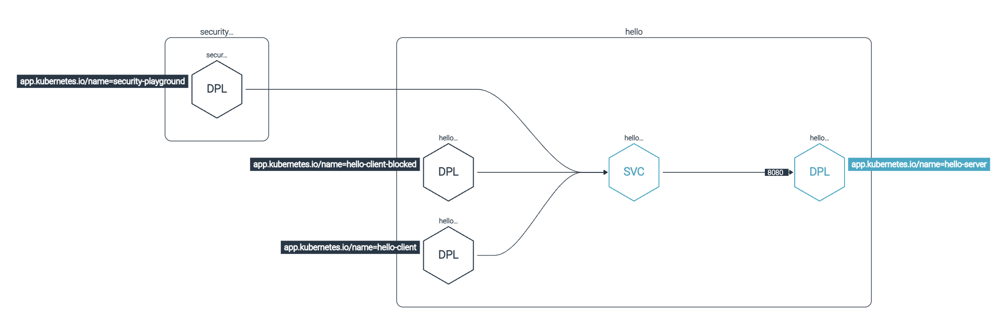
1. Click the **Ingress** tab
1. Here you can untick anything we don't want talking to our hello-server service. 
    1. Untick everything but **hello-client**
    1. 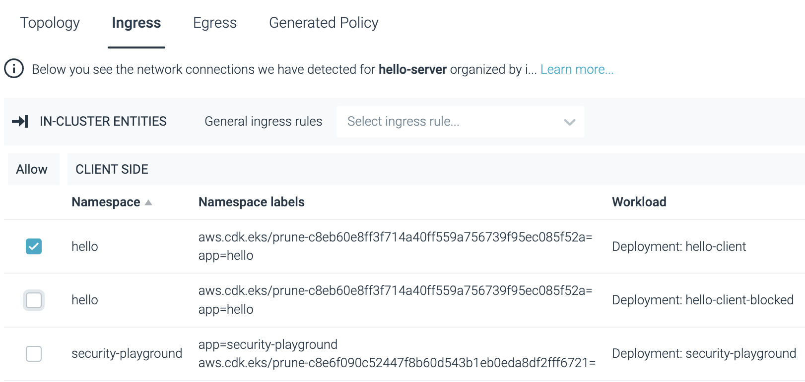
1. Click back to **Topology** and now you'll see the things we are going to block with red lines (with the only allowed/black path being to hello-client)
    1. 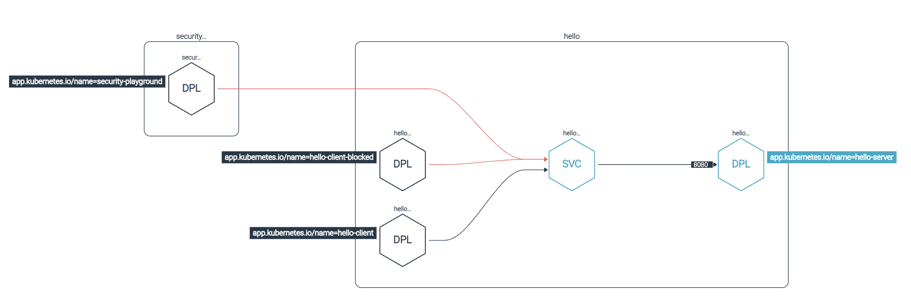
1. Click **Generated Policy** and copy all the contents to your clipboard
    1. 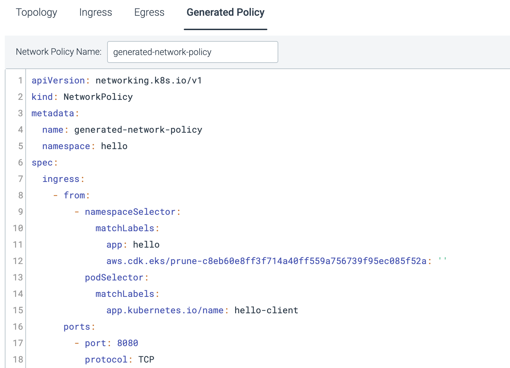
1. Go back to your jumpbox terminal browser tab
1. Run **vi policy.yaml** 
1. Type I to go into insert mode
1. Paste it in there with a **Shift-Ctrl-V** on PC or a **Shift-Command-V** on Mac
1. Press Esc to leave insert mode then type **:wq** to save and exit
1. Type **kubectl apply -f policy.yaml** to apply it
1. Run **./example-curls-networkpolicy.sh** again to see that it now cannot reach hello-server due to our new NetworkPolicy (it will timeout)
1. Run **kubectl logs deployment/hello-client-blocked -n hello** to see the logs from the hello-client-blocked service showing that it too has now been blocked by the NetworkPolicy (wget: download timed out)
1. Run **kubectl logs deployment/hello-client -n hello** to see the logs from the hello-client service showing it still **can** still reach hello-server like we intended

#### Controlling Network Egress - especially to the Internet

This isn't just useful for controlling the ingress to services like we just did with hello-server, but also for limiting egress - especially to the Internet - as well.

Let's look at how this could help with our insecure security-playground example from above:
1. Go back to the Sysdig browser tab
1. In the **Network** section choose the **security-playground** namespace and the **Deployment** object type
    1. 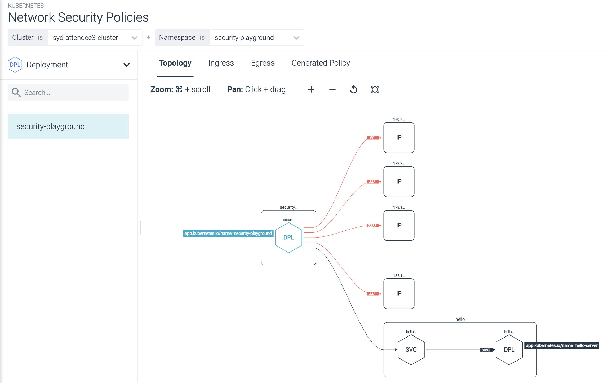
1. Here you'll not only see the other side of the hello-server interaction (this deployment calling out to hello-server) - but also all the Internet IPs that it talked out to as we did our curls - to download apt packages and talk to the crypto miner pool etc.
1. You can generate a NetworkPolicy excluding all that Internet egress like we did above - go to the **Egress** tab
    1. We actually default to excluding all IPs/CIDRs outside the cluster (that is why the lines are red):
        1. Untick the hello-server so that security-playground won't be able to egress to that
        1. Note that it shows not just the IPs we were talking to but the process name that was talking to them. 
            1. If you wanted to allow these you can click the checkmark with a plus icon to the right of them - and click that again to remove (when it turns into a checkmark with a minus)
    1. 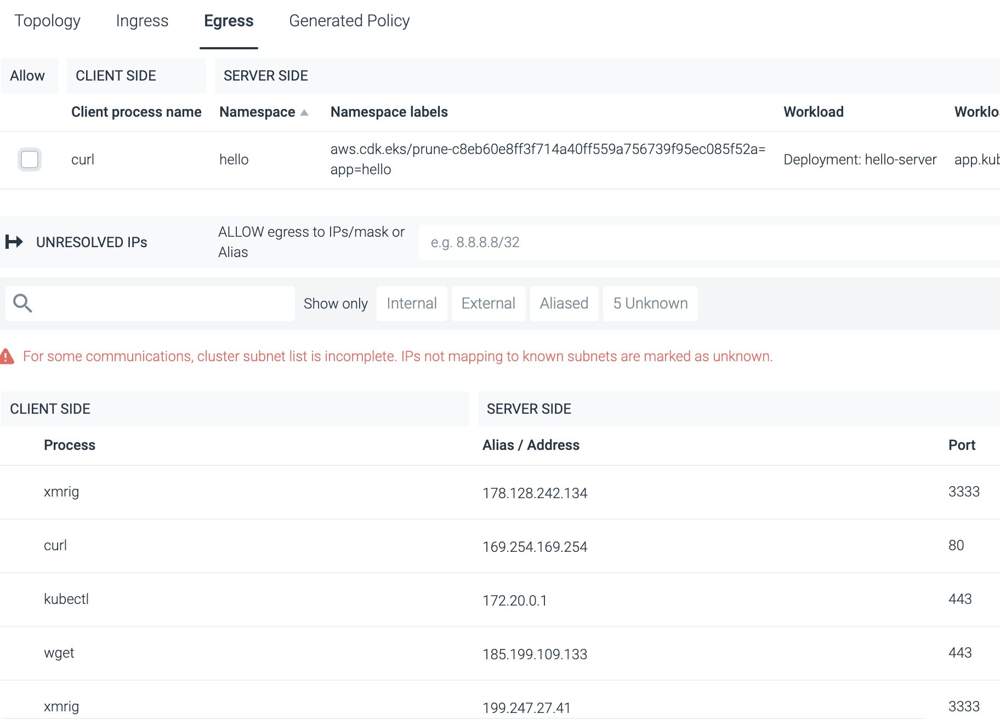
    1. This is another control that would prevent many of the things we did with our curls at the start!
1. Go to the Generated Policy tab
    1. Rather than use the Generated Policy as-is, we'll remove the Ingress line from the policyTypes so we can still reach the service first.
        1. Copy and paste this into a text editor and remove the Ingress lines and then copy that now Ingress-less policy to your clipboard
    1. 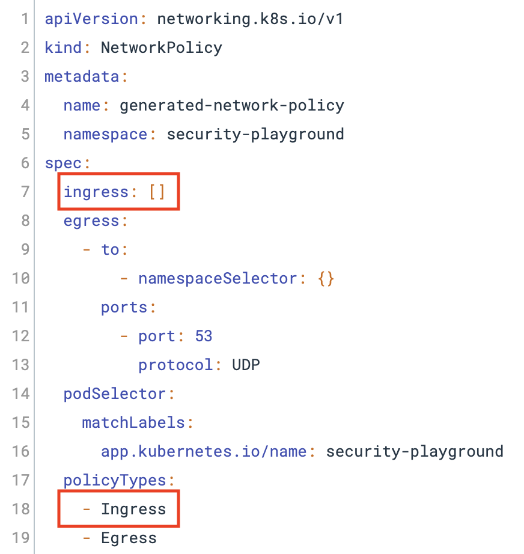
1. Go back to your jumpbox terminal browser tab
1. Run **vi policy2.yaml** 
1. Type I to go into insert mode
1. Paste it in there with a **Shift-Ctrl-V** on PC or a **Shift-Command-V** on Mac
1. Press Esc to leave insert mode then type **:wq** to save and exit
1. Type **kubectl apply -f policy2.yaml** to apply it
1. Re-run **example-curls.sh** and note how much of what happened there this NetworkPolicy blocked
    1. Note that when we broke out of our container to the host then the NetworkPolicy no longer applied (but any firewall/SecurityGroup covering the Node would have).
        1. This is another big reason we need to prevent container escapes!

To learn more about the syntax of NetworkPolicies there is a great resource on GitHub with examples of all the common patterns - https://github.com/ahmetb/kubernetes-network-policy-recipes.

## Conclusion

This was just a brief introduction of some of the many capabilities that Sysdig offers customers to help with securing your Kubernetes environments, including AWS EKS, as-a-service.

We'd love to show you more about what Sysdig can do for you in a free trial in your own environment. Reach out to your facilitator for details.

Thank you for coming!
